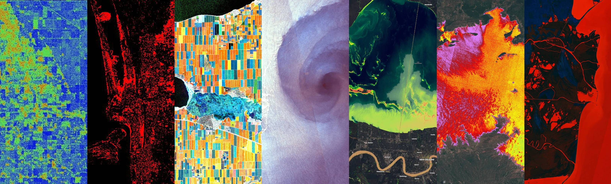

# Copernicus Data Space Ecosystem Sentinel Hub Custom Script Repository

This repository contains a collection of custom scripts for the [Copernicus Browser](https://browser.dataspace.copernicus.eu/) and the [Sentinel Hub APIs](https://dataspace.copernicus.eu/analyse/apis/sentinel-hub) on the [Copernicus Data Space Ecosystem](https://dataspace.copernicus.eu/).

Custom scripts are a piece of Javascript code, used to visualize satellite imagery and to control what values the Sentinel Hub services will return. Any visualization of any constellation (e.g. Sentinel-2 satellite), even a simple true color composite, is dictated by a custom script.

See [here](https://documentation.dataspace.copernicus.eu/APIs/SentinelHub/Evalscript/V3.html) for more information on how to write your own evalscript.

## Contribute to Custom Scripts

Have a look at the [template](./contribute/example) for an example of how a script folder can be structured.

You can also have a look at other scripts to see how they are structured.

For instructions on how custom scripts are structured have a look at this [YouTube tutorial](https://www.youtube.com/watch?v=0OySOAL9lY4), or at the [official documenation](https://documentation.dataspace.copernicus.eu/APIs/SentinelHub/Evalscript.html).

## How to publish your own product

- Fork the repository to get your own copy of the custom-scripts repository

- Create a new directory entry for your custom script  
  _Copy the `example` directory to proper directory, based on which datasource (satellite) you are publishing the product for, to something that describes what the product is about, say `my_algorithm`._  
  _Preferably use ["snake_case"](https://simple.wikipedia.org/wiki/Snake_case) (underscores instead of spaces) if more than one word is used._
- Fill in the details about the project in the `README.md` file.  
  _Have a look around at other `README.md` files to see how to include images, format the text and generally use the GitHub [markdown](https://help.github.com/categories/writing-on-github/)._
- Implement the product in the `script.js` file located in a `scripts` folder.
  _The most work is of course the JavaScript implementation of the product. The `example` folder includes a basic custom script to help you build your own custom script._

- If you want to include images in your `README.md` file, add them to the `figs` folder.

- Create a pull request.

Publishing your product should be easy, nevertheless, any feedback and ideas how to improve or make the process simpler is very appreciated.
