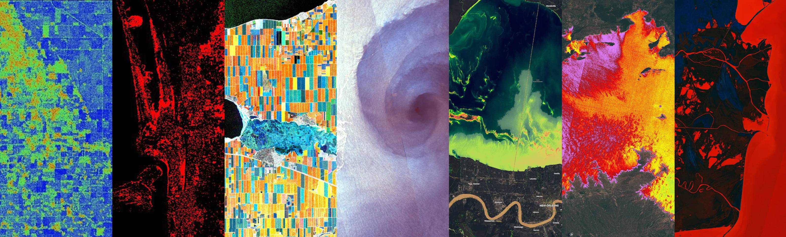

# Copernicus Data Space Ecosystem Sentinel Hub Custom Scripts Repository



This repository contains a collection of custom scripts for the [Copernicus Browser](https://browser.dataspace.copernicus.eu/) and the [Sentinel Hub APIs](https://dataspace.copernicus.eu/analyse/apis/sentinel-hub) on the [Copernicus Data Space Ecosystem](https://dataspace.copernicus.eu/).

Custom scripts are a piece of Javascript code, used to visualize satellite imagery and to control what values the Sentinel Hub services will return. Any visualization of any constellation (e.g. Sentinel-2 satellite), even a simple true color composite, is dictated by a custom script.

See [here](https://documentation.dataspace.copernicus.eu/APIs/SentinelHub/Evalscript/V3.html) for more information on how to write your own evalscript.

## Contribute to Custom Scripts

Have a look at the [template](./contribute/example) for an example of how a script folder can be structured.

You can also have a look at other scripts to see how they are structured.

For instructions on how custom scripts are structured have a look at this [YouTube tutorial](https://www.youtube.com/watch?v=0OySOAL9lY4), or at the [official documentation](https://documentation.dataspace.copernicus.eu/APIs/SentinelHub/Evalscript.html).

## How to publish your own product

- Fork the repository to get your own copy of the custom-scripts repository

- Create a new directory entry for your custom script  
  _Copy the `example` directory to proper directory, based on which datasource (satellite) you are publishing the product for, to something that describes what the product is about, say `my_algorithm`._  
  _Preferably use ["snake_case"](https://simple.wikipedia.org/wiki/Snake_case) (underscores instead of spaces) if more than one word is used._
- Fill in the details about the project in the `README.md` file.  
  _Have a look around at other `README.md` files to see how to include images, format the text and generally use the GitHub [markdown](https://help.github.com/categories/writing-on-github/)._
- Implement the product in the `script.js` file located in a `scripts` folder.
  _The most work is of course the JavaScript implementation of the product. The `example` folder includes a basic custom script to help you build your own custom script._

- If you want to include images in your `README.md` file, add them to the `figs` folder.

- Create a pull request.

Publishing your product should be easy, nevertheless, any feedback and ideas how to improve or make the process simpler is very appreciated.

# Development

## 1. Technology Stack
* **SSG:** Hugo (extended version recommended for Sass processing).
* **Styling:** SCSS (preprocessed using Hugo Pipes).
* **Interactivity:** Vanilla JavaScript for search, sidebars, and tab selectors.

---

## 2. Local Development Setup

To run this project locally, you need to [install](https://gohugo.io/installation/) the latest version of Hugo, then see the [documentation](https://gohugo.io/about/introduction/) about how hugo works.

***Warning:*** If you are using Ubuntu or Debian, apt version of Hugo is considerably older. Install with snap.

### Prerequisites

#### Linux (Debian/Ubuntu)
We recommend installing the **extended** version of Hugo for Sass/SCSS compiling:
```bash
sudo apt install hugo
```

#### macOS (Homebrew)
```bash
brew install hugo
```

#### Windows (Chocolatey)
```bash
choco install hugo-extended -confirm
```

### Running the Site

1. Clone this repository and open the project directory.
2. Spin up the development server:
   ```bash
   hugo server
   ```
3. Open your browser and go to `http://localhost:1313`.

The local server supports hot-reloading: changes to your Markdown content, JS, or SCSS files will instantly refresh the page in the browser.

### Formatting and Linting

| Files          | Formatter | Linter       |
| -------------- | --------- | ------------ |
| Markdown       | Prettier  | markdownlint |
| JavaScript     | Prettier  | ESLint       |
| Hugo templates | djlint    | djlint       |

Prettier also covers SCSS, YAML and JSON.

#### Installing the tools

Everything except djlint is installed with npm, so you need [Node.js](https://nodejs.org/):

```bash
npm install
```

djlint is a Python tool. It is run through [uv](https://docs.astral.sh/uv/), which downloads it on first use, so there is nothing else to install:

```bash
brew install uv                                   # macOS
curl -LsSf https://astral.sh/uv/install.sh | sh   # Linux
choco install uv -confirm                         # Windows
```

#### Running them

```bash
npm run format                   # Markdown, JS, SCSS, YAML, JSON
npm run format:check             # report only, does not write

npm run format:templates         # Hugo templates
npm run format:templates:check   # report only, does not write

npm run lint                     # ESLint and markdownlint
npm run lint:templates           # djlint
```

`npm run lint` needs Node only, so you can check a content change without installing the Python tooling. The two `:templates` commands need uv.

`layouts/_markup/` is excluded from template formatting. Those templates are inserted into the middle of page text, so reformatting them would change the rendered page.

---

## 3. Project Structure

Here is how the repository is organized:

```text
/sentinel-hub-custom-scripts/
├── config/                  # Environment-based site configurations
│   ├── _default/            # Global/default configuration
│   │   └── hugo.toml        # Defines site title, taxonomies, syntax highlighting
│   ├── development/
│   └── production/
├── content/                 # Site pages & script documentation
│   ├── _index.md            # Home page configuration and introduction
│   └── script/              # Script directories grouped by sensor
│       ├── sentinel-2/
│       │   └── city-highlights/  # An example of a Leaf Bundle
│       │       ├── index.md      # Page content and metadata
│       │       ├── script.js     # Evalscript source file
│       │       └── fig/          # Images used specifically on this page
│       └── sentinel-5/
├── layouts/                 # HTML Templates & Partials
│   ├── baseof.html          # Shell layout (HTML wrapper, grid, head, footer)
│   ├── home.html            # Main landing page template
│   ├── _partials/           # Shared components (headers, footers, icons)
│   └── script/              # Templates specifically for the script pages
│       ├── list.html        # Sensor/listing page template
│       └── single.html      # Individual script page template (with interactive tabs)
├── assets/                  # Assets compiled & processed by Hugo Pipes
│   ├── js/
│   │   └── main.js          # Client-side logic (tab selection, copying, sidebar)
│   └── scss/
│       └── main.scss        # Site styling
└── static/                  # Static assets copied directly to build output
```

---

## 4. How to Add a New Custom Script

Custom scripts in this project are managed as **Hugo Leaf Bundles** (directories containing an `index.md` and related local assets). This isolates script codes, preview images, and markup descriptions.

### Step-by-Step Instructions

#### Step 4.1: Create a Leaf Bundle Folder
Navigate to the directory of the respective satellite sensor (inside `content/script/<sensor>/`) and create a new directory for your script:
```bash
mkdir -p content/script/sentinel-2/my-new-script/fig
```

#### Step 4.2: Add the Source Code File
Place the raw Sentinel Hub JavaScript file into your new directory:
* `content/script/sentinel-2/my-new-script/script.js`

*Note: You can include multiple JS files if your script has variations (e.g., `script_v1.js`, `script_v2.js`). You will reference these in the metadata.*

#### Step 4.3: Add Preview Figures
Save representative screenshots (e.g., comparison images showing the visual outputs or specific highlights) inside your `fig/` folder:
* `content/script/sentinel-2/my-new-script/fig/example_output.png`

#### Step 4.4: Create the `index.md` and Configure Frontmatter
Create an `index.md` file inside `content/script/sentinel-2/my-new-script/` and configure the metadata at the top (frontmatter):

```markdown
---
title: "My Amazing Custom Script"
evalscripts: ["script.js"]
fields: ["vegetation", "agriculture"] # Domain/field taxonomy tags
---

## General description of the script

Provide a clear and concise explanation of what your script does, what formula or index it relies on (e.g., NDVI, NDWI), and any thresholds used.

## Author of the script

[Author Name]

## Description of representative images

Explain what is depicted in the figures.

Example 1:

```

---

## 5. Working with Taxonomies & Metadata

Taxonomies are configured globally in `config/_default/hugo.toml`. They enable filtering, tags, and robust categorization across the site.

When you add a script, you can specify terms for any of these supported taxonomies in the frontmatter of your `index.md`:

| Taxonomy | Frontmatter Key | Common Values / Terms |
| :--- | :--- | :--- |
| **Types** | `type` | `composite`, `index`, `regression`, `classification` |
| **Verifications** | `verification` | `cites literature`, `cites operational use case` |
| **Default** | `default` | `default`, `custom` |
| **Domains** | `domain` | `atmosphere`, `agriculture`, `disasters`, `urban`, `water`, `vegetation`, `forest`, `fire`, `flood`, `geomorphology` |
| **Data-Sources** | `data-source` | `Data fusion`, `Sentinel-1`, `Sentinel-2`, `Sentinel-3`, `Sentinel-5P`, `CLMS`, `DEM` |
| **Resolutions** | `resolution` | `10m`, `60m`, `300m` ... |

Explanation of types:
- **composite**: bands shown as red/green/blue so the output is an image, generated by assigning a spectral product to each band of an image (like RGB ratio, like true color)
- **index**: a fixed formula that scores every pixel on one property, a scalar generated by calculating a single value from one or more spectral bands and visualizing it with a palette (like NDVI)
- **regression**: a real physical quantity you could measure with an instrument, an index that is calibrated to a meaningful physical quantity that has a dimension (like Leaf Area Index, like land surface temperature)
- **classification**: every pixel sorted into one of a few named categories, an operation on one or more bands where the outcome is a unique value from a pre-defined set - typically based on threshold values from one or more regresssions (like flood mapping, like land cover)

### Frontmatter Example with Full Taxonomies:
```yaml
---
title: "Advanced Agricultural Monitoring"
evalscripts: ["script.js"]
domain: ["agriculture", "vegetation"]
type: ["index"]
verification: ["cites literature"]
resolution: ["10m"]
data-source: ["Sentinel-2"]
---
```

---

## 6. How Templates Render Scripts Automatically

The templates in `layouts/script/single.html` contain robust logic designed to automate rendering. 

When Hugo builds a script page it will:
1.  Read the `evalscripts` list in your frontmatter.
2.  Grab the `.js` files from the same folder.
3.  Generate selection tabs for them automatically.
4.  Apply server-side syntax highlighting (`transform.Highlight`).
5.  Generate copy buttons to copy both the code block and the permalink of the raw `.js` file directly.

This means you never need to copy-paste your code blocks into the markdown file manually! Simply keep the `.js` files in your bundle folder.
