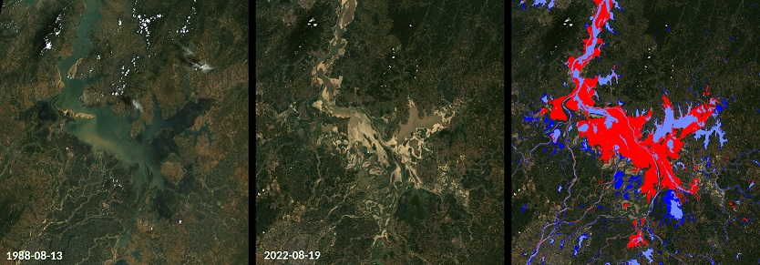
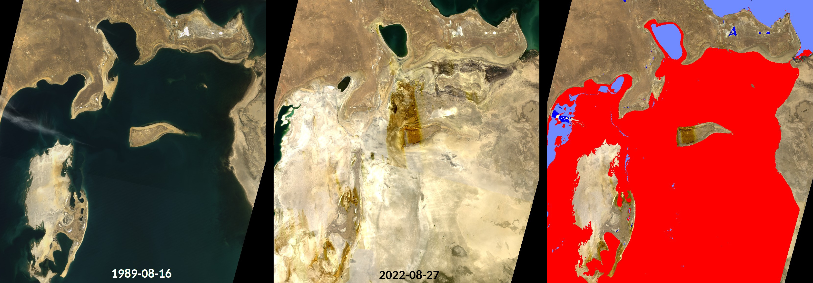
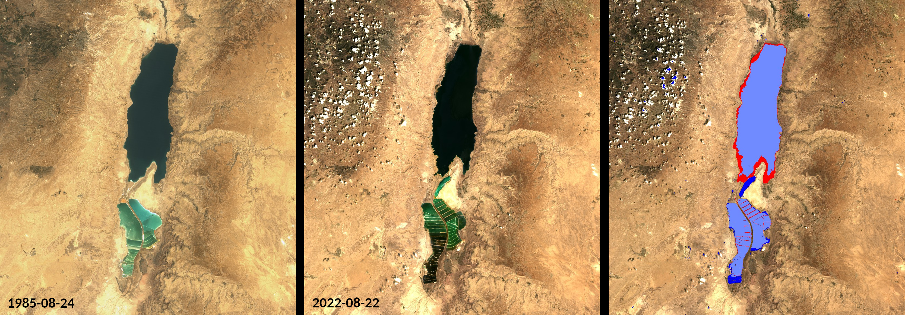

## General description of the script

Climate change contributes to more frequent or more severe droughts and floods in many regions of the world, among other things. Satellite Earth observation is extremely useful to document these changes, for example by monitoring water bodies. The Landsat program provides particularly useful data for demonstrating variations in the extent of lakes over the last decades, for example, as it provides the longest-running record of satellite observations since the 1970s.

This script is a custom script for the Copernicus Browser. It maps the extent of water bodies in two Landsat images (or a Landsat and Sentinel image) defined by the user and then visualizes the changes between both scenes. The script is able to compare images both from the Landsat 8-9 Level-1 and Sentinel-2 datasets.

You can follow these steps to use `script_landsat.js` in the Copernicus Browser:
1. Find a Landsat image at the end of the period you want to establish the comparison
2. Paste the script in the script editor of the `Custom` tab
3. Click `Use additional datasets (advanced)`
4. Rename `LANDSAT-OT-L1` to `LANDSAT_NEWER`
5. Under `Additional datasets`, look for `Landsat-8/9 L1` in the dropdown list and click the add button (`+`)
6. Rename `LANDSAT-OT-L1-1` to `LANDSAT_OLDER`
7. Check `Customize timespan` at the end of the new subsection
8. Set a date with a Landsat image. This date represents the beginning of the comparison period
9. Click the `Apply` button at the bottom

You can follow these steps to use `script_landsat_s2.js` in the Copernicus Browser:
1. Find a Landsat image at the end of the period you want to establish the comparison
2. Paste the script in the script editor of the `Custom` tab
3. Click `Use additional datasets (advanced)`
4. Rename `LANDSAT-OT-L1` to `LANDSAT_NEWER`
5. Under `Additional datasets`, look for `S-2 L2A` in the dropdown list and click the add button (`+`)
6. Rename `S2L2A` to `S2_OLDER`
7. Check `Customize timespan` at the end of the new subsection
8. Set a date with a Sentinel-2 image. This date represents the beginning of the comparison period
9. Click the `Apply` button at the bottom

## Author of the script
- Jan Landwehrs

## Description of representative images 

**Example 1: Lake Poyang**

As an example, the pictures below show the Poyang Lake in August 1988 and 2022 as well as the lake extent changes detected by the presented script. The Poyang Lake is China’s largest freshwater lake and experiences significant lake level variations between the dry and the wet monsoon seasons. However, it experienced an extreme shrinkage in 2022 associated with a severe drought and heat wave in Southern China [1]. Red and dark blue colors indicate retraction or expansion of the detected water bodies from the older to the more recent image, respectively. 

Landsat images of Lake Poyang on 1988-08-13 (left, Landsat 4-5-TM Level-2 True Color Image) and on 2022-08-19 (middle, Landsat 8-9 Level-2 True Color Image). 
The rightmost panel shows changes in the water body extent between both scenes detected by the presented script.(Red / Dark Blue: detected water body receded / expanded. Light Blue: water detected in both scenes.)
   

[See high resolution version](https://github.com/JanLandwehrs/LakeExtentChangeDetection_SentinelHub-ScriptContest/blob/main/PoyangLake_1988-2022_LandsatImages.jpg)

**Exaple 2: Aral Sea**

Changes in Aral Sea water body extent between 1985-08-24 and 2022-08-22.

[See high resolution version](https://github.com/JanLandwehrs/LakeExtentChangeDetection_SentinelHub-ScriptContest/blob/main/AralSea_1989-2022_LandsatImages.jpg)

**Example 3: Dead Sea**

Changes in Dead Sea water body extent between 1989-08-16 and 2022-08-27. 

[See high resolution version](https://github.com/JanLandwehrs/LakeExtentChangeDetection_SentinelHub-ScriptContest/blob/main/DeadSea_1985-2022_LandsatImages.jpg)

## Credits

The presented script was inspired by the [water body detection script](https://github.com/sentinel-hub/custom-scripts/tree/master/sentinel-2/water_bodies_mapping-wbm) by Mohor Gartner.

## References

- [1] NASA Earth Observatory 2022, [Parched Poyang Lake](https://earthobservatory.nasa.gov/images/150285/parched-poyang-lake)
- [2] Hanqiu Xu 2006, [Modification of normalised difference water index (NDWI) to enhance open water features in remotely sensed imagery](https://doi.org/10.1080/01431160600589179)
