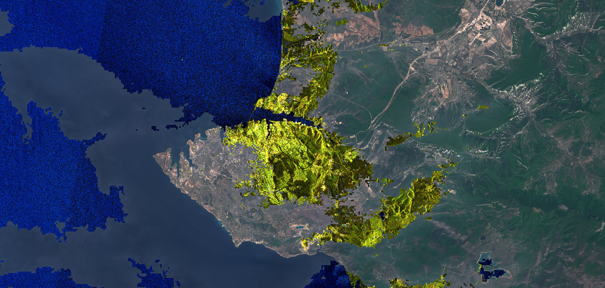

## General description of the script
The script uses cloud masks to identify cloudy sentinel-2 areas and replace the data with terrain visualisation based on Sentinel-1 data.

## Author of the script
- Pierre Markuse, (Twitter: @pierre_markuse)

## Description of representative images  

Sevastopol with cloudy areas in Sentinel-1, and non-cloudy areas in Sentinel-2. 

## License

 - [CC BY 4.0 International](https://creativecommons.org/licenses/by/4.0/)
