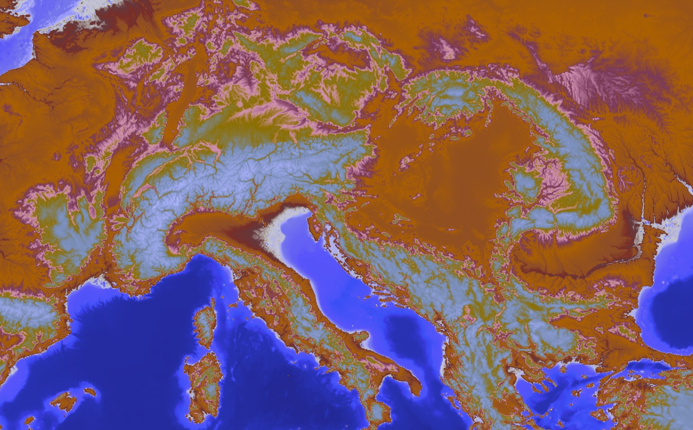

## General description of the script

This script returns a color visualization of a digital elevation model, assigning continuous colors to the elevation borders.

It is possible to set custom min and max values in the evalscript by setting the min and max variables to the desired values.

## Description of representative images

