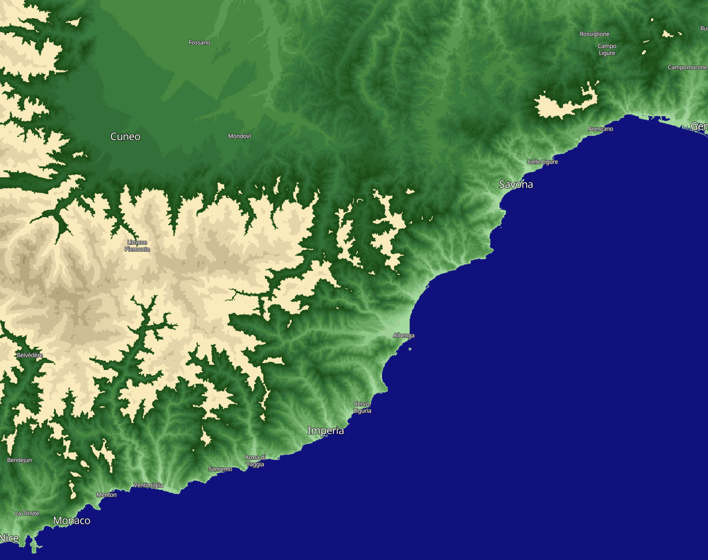

## General description of the script

Sentinel Hub supports **Copernicus DEM** in the CDSE. **Copernicus DEM** is based on WorldDEM that is infilled on a local basis with the following DEMs: ASTER, SRTM90, SRTM30, SRTM30plus, GMTED2010, TerraSAR-X Radargrammetric DEM, ALOS World 3D-30m.

This script returns a visualisation with green colours representing lowland elevations and earth colours as mountainous elevations. The script uses discrete classes rather than the continuous visualisations in the other DEM evalscripts in this repository.

## Author of the script
 
William Ray

## Description of representative images

## Color table

| Elevation range | HTLM color code |  Color |
|-----------------|-----------------|--------|
| Below Sea Level | #0f0f8c | !#0f0f8c |
| 0-10m | #175408 | !#175408 |
| 10-25m | #1f5e14 | !#1f5e14 |
| 25-50m | #266921 | !#266921 |
| 50-75m | #2e732e | !#2e732e |
| 75-100m | #367d3b | !#367d3b |
| 100-200m | #3d873d | !#3d873d |
| 200-300m | #4d9440 | !#4d9440 |
| 300-400m | #5ea354 | !#5ea354 |
| 400-500m | #73b366 | !#73b366 |
| 500-600m | #7aba70 | !#7aba70 |
| 600-700m | #85c27a | !#85c27a |
| 700-800m | #96cf8f | !#96cf8f |
| 800-900m | #a6d69c | !#a6d69c |
| 900-1000m | #abdea1 | !#abdea1 |
| 1000-1500m | #fcedbf | !#fcedbf |
| 1500-2000m | #ebd9b0 | !#ebd9b0 |
| 2000-2500m | #d6c49e | !#d6c49e |
| 2500-3000m | #c2b08a | !#c2b08a |
| 3000-3500m | #ad9c75 | !#ad9c75 |
| 3500-4000m | #998761 | !#998761 |
| 4000-4500m | #87734d | !#87734d |
| 4500-5000m | #736138 | !#736138 |
| 5000-5500m | #5e4d26 | !#5e4d26 |
| 5500-6000m | #4a3812 | !#4a3812 |
| 6000-7000m | #e6e6e6 | !#e6e6e6 |
| 7000-8000m | #f2f2f2 | !#f2f2f2 |
| 8000m + | #ffffff | !#ffffff |
