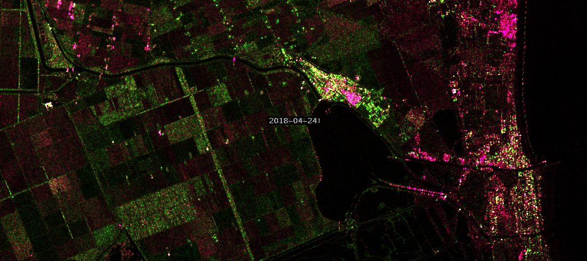
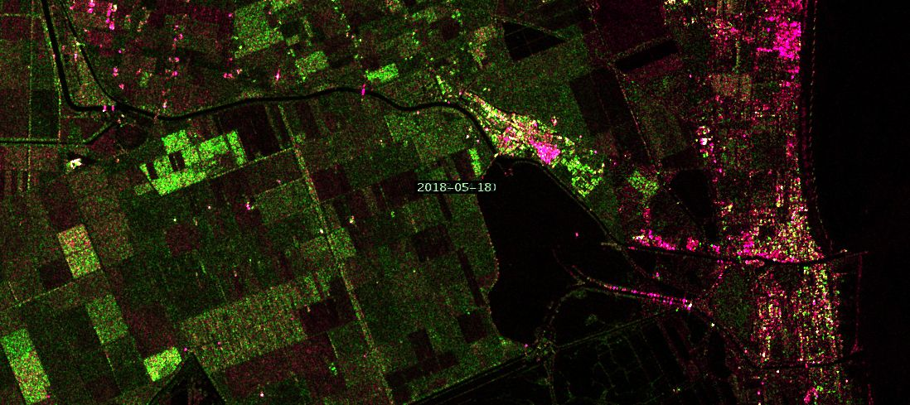
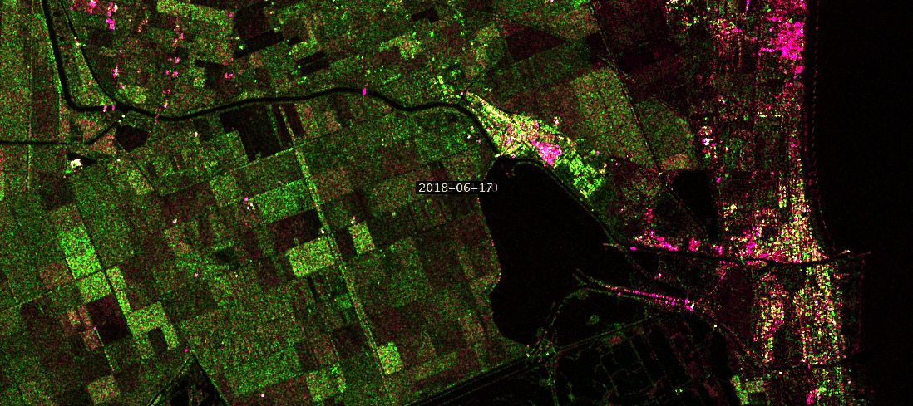
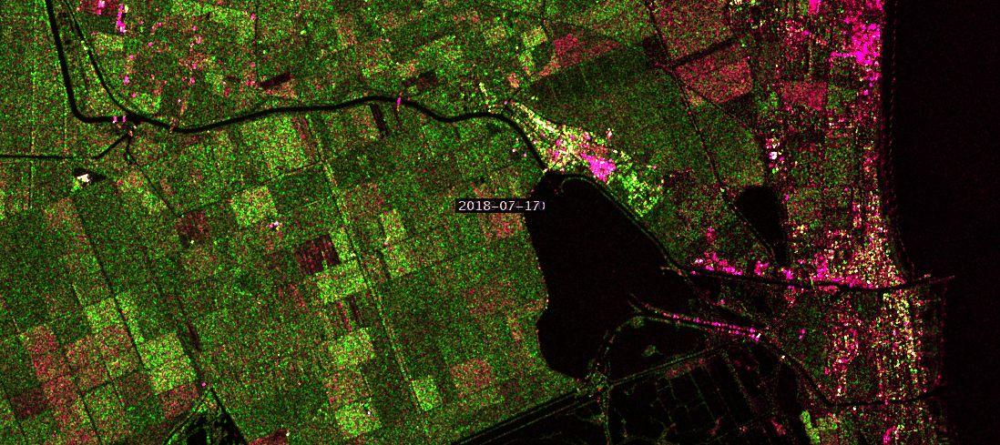
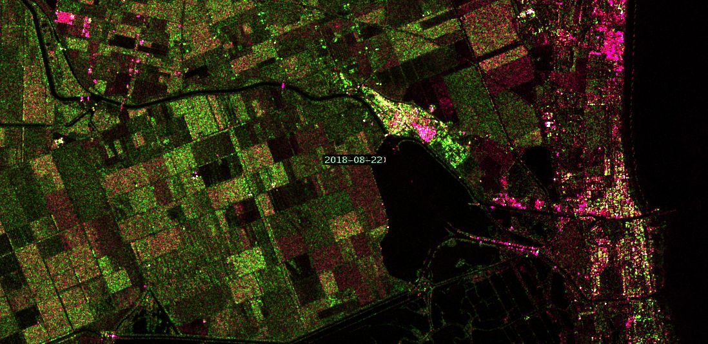

## General description of the script

In agriculture, remote sensing images provide information of damaged crop, crop extent, crop productivity. These images can be also used to distinguish crops from other land classes, evaluate the effects of rainfall, irrigation systems, droughts, floods, fertilizer, pesticide. The provided information would be useful to farmers, governments, and agricultural insurance companies.

In order to provide the state of agricultural fields, we need to multi-temporal remote sensing images. The script is based on the time series of Sentinel-1 radar data. Using multi-temporal information from radar images makes it possible to improve the outputs of optical images. In the script, a time series of nine Sentinel-1 IW GRD images with VV and VH polarizations in a selected timeline is used as an input.

## Details of the script

The images were acquired during the period from 2018/04/20 to 2018/08/22, in the region of Ferrara, Italy. The image of 2018/04/20 was used as the master image.

The output of the script gives a good view of where crops are growing well, or where crops are not growing, and identifies the surrounding water bodies and urban areas. The different colours in the crop fields display the growth stage variations between the crops. The results of the script are consistent with the Normalized Difference Vegetation Index (NDVI).

See more details about the script in [the supplementary material](supplementary_material.pdf).

## Author of the script

Maryam Salehi

## Description of representative images

The images below are composed as:

                R = 1.5×VV_slave, G = 8×(VH_slave − VH_master), B = 0.5×VV_slave

1. Ferrara, Italy on April 24th, 2018

2. Ferrara, Italy on May 5th, 2018

3. Ferrara, Italy on June 17th, 2018

4. Ferrara, Italy on July 7th, 2018

5. Ferrara, Italy on August 22nd, 2018

