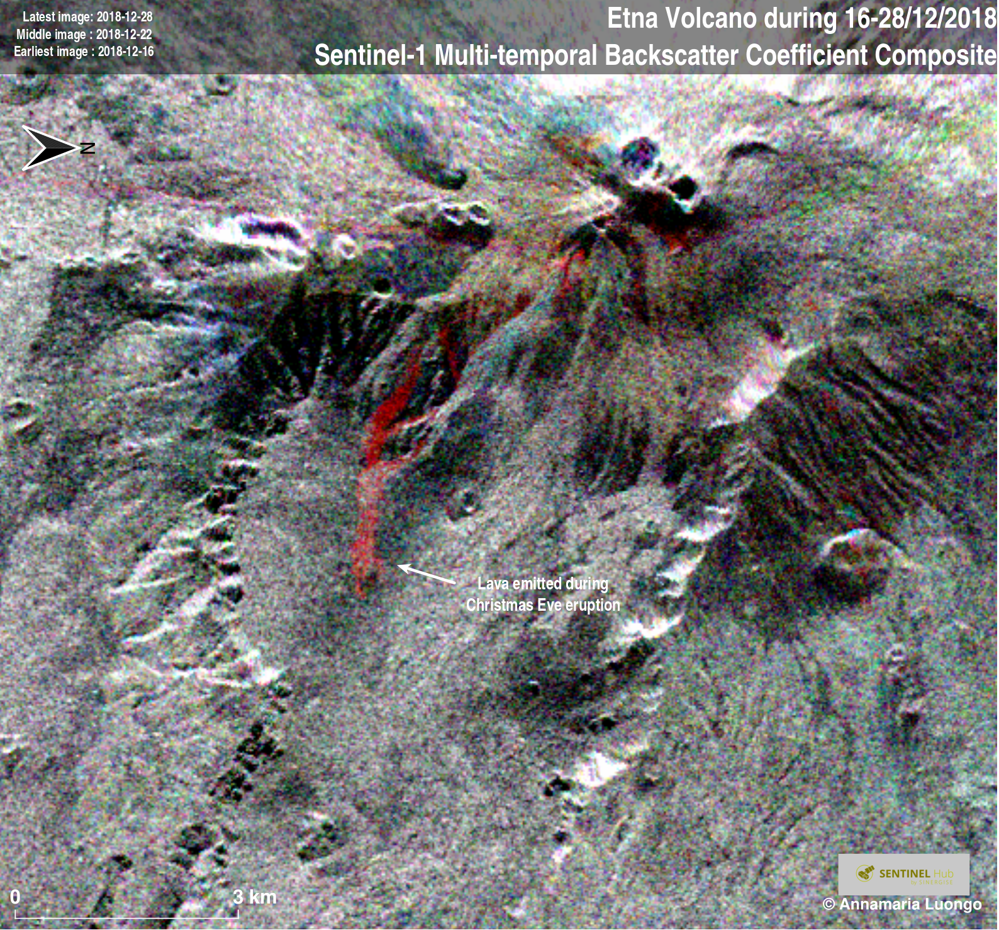

## Description  

For the interpretation of results, you can use The Synthetic Aperture Radar (SAR) Handbook: Comprehensive Methodologies for Forest Monitoring and Biomass Estimation, 2019: table 3.1 page 66.  
The book is available for free [here.](https://www.servirglobal.net/Global/Articles/Article/2674/sar-handbook-comprehensive-methodologies-for-forest-monitoring-and-biomass-estimation)  
The script visualizes Earth surface in False Color from Sentinel-1 data. It helps in maritime monitoring (such as ice monitoring, ship monitoring), land monitoring (agriculture, deforestation), and emergency management (flood monitoring, volcano monitoring).  

## Examples

## Contributors:  

[Annamaria Luongo](https://twitter.com/annamaria_84)    
