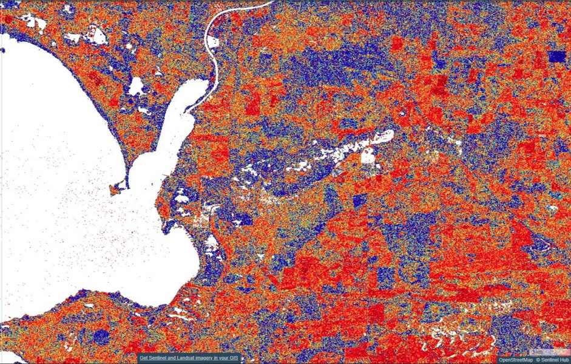
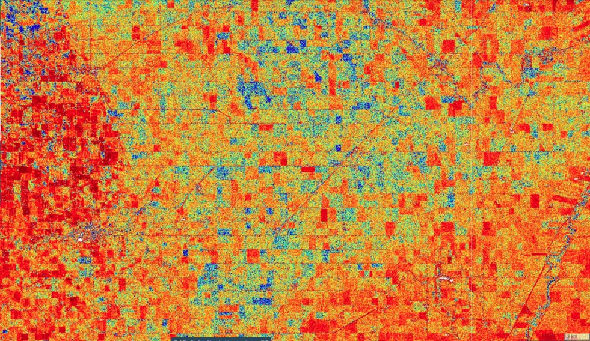
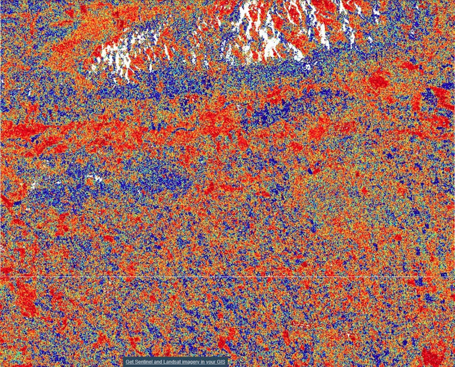
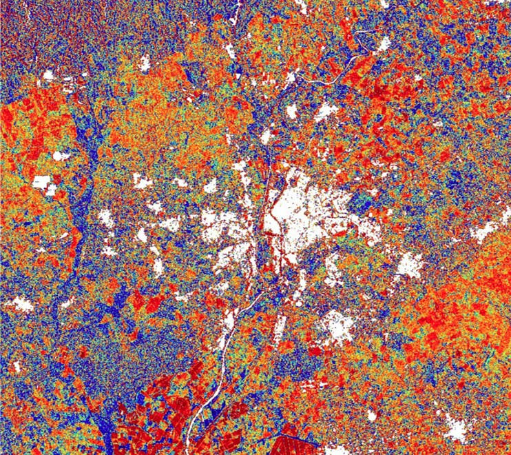
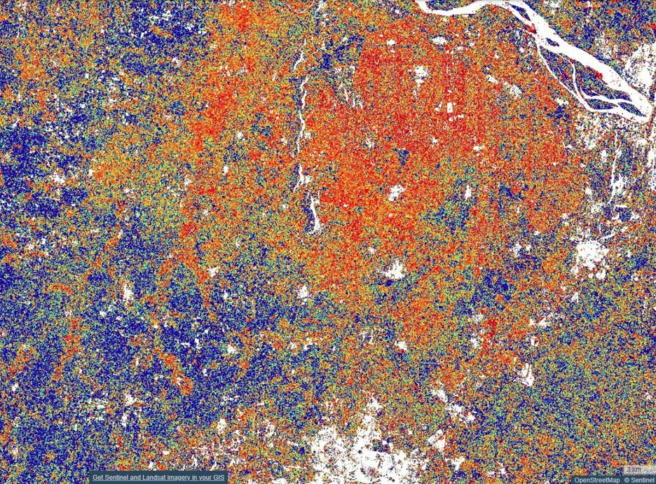

## General description of the script

Script estimates surface soil moisture using change detection algorithm (TU Wien Change Detection model). The algorithm relates the change in backscatter intensity to the change in moisture. This relative change in soil moisture converted to absolute soil moisture by attributing the lowest and highest backscatter values to 0% and 100 % soil moisture respectively for a given pixel. To avoid the effect of outliers in caculating sensitivity of back scatter intensity (max-min), extreme 10% range on both sides was trimmed. This script produces soil moisture ranges from 0 to 60% with colour representation of red being 0 and blue as 60%. White colour represents the masked out area. Permanent water bodies and urban areas are masked out using backscatter intensity thresholds to minimise the number of false pixels. This masking approach is robust since it utilises long time series data.

## Details of the script

The script to estimate surface soil moisture using change detection approach can be applied globally. Since we are considering 3-year data in calculating the sensitivity of backscatter fluctuations, it is resistant to seasonal fluctuations. It is capable of masking urban and permanent water bodies to reduce false results. The script can produce reasonably good results in flat and moderate slope terrains. But in high slope regions, the incidence angle effect on backscatter intensity affect the results. Rough water surfaces result in false results, e.g. oceans, but not always. Few developing urban areas may also produce false results.

For more details on the script see [supplementary material](supplementary_material.pdf).

## Author of the script

Narayana Rao Bhogapurapu

## Description of representative images

Resulted soil moisture is applied with jet color map for better interpretation. Red color represents low soil moisture (dry soil-0%) whereas blue represents high soil moisture (wet soil-60%). Permanent water bodies and built-up areas are masked out with white color.

Malinong, Australia

Manitoba, Canada

Marrakech, Marocco

Sevilla, Spain

Vijayawada, India

## References

[1] Wagner, W., Lemoine, G., Borgeaud, M. and Rott, H., 1999. A study of vegetation cover effects on ERS scatterometer data. IEEE Transactions on Geoscience and Remote Sensing, 37(2), pp.938-948.

[2] B. Bauer-Marschallinger et al., "Toward Global Soil Moisture Monitoring With Sentinel-1: Harnessing Assets and Overcoming Obstacles," in IEEE Transactions on Geoscience and Remote Sensing, vol. 57, no. 1, pp. 520-539, Jan. 2019.
