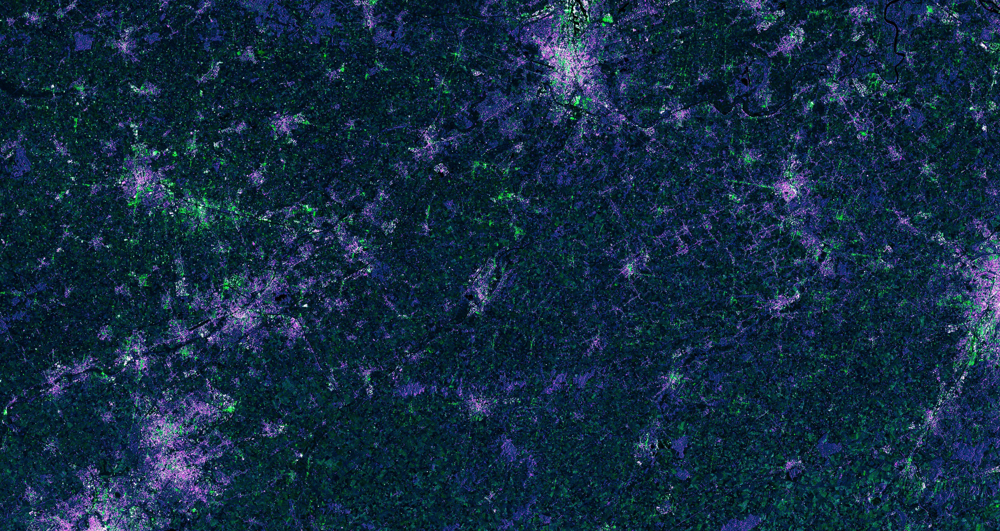

## General description of the script

The script is useful for locating urban areas and individual buildings. It uses VH and VV polarizations to highlight different buildings and topology orientations with purple and green colors. It can be used to track urban expansion, estimate building type or locate buildings in high-risk areas (such as floods).

Some buildings highly reflect VV, which was input into the green channel, and other buildings reflect VH values. To separate buildings from barren soil and mountan areas, the red band was limited to only highly reflected values of higher than 0.5 VH. VH was also input into the blue channel and left as is, so that these areas are colored blue, and highly reflective ones (buildings) mix with the red channel, producing purple buildings. Buildings are thus either purple (reflecting VH), green (reflecting VV) or white (reflecting both) based on the building structure/material. The bands were multiplied by 5.5 and 8 for aesthetic purposes.

The script does not work well in high elevation areas, where snow and high slopes are also highlighted, so that it becomes difficult to separate urban areas from the rest of the surface.

## Author of the script

Monja B. Šebela

## Description of representative images

Visualization of urban areas in Bologna, Italy with the urban areas script:

