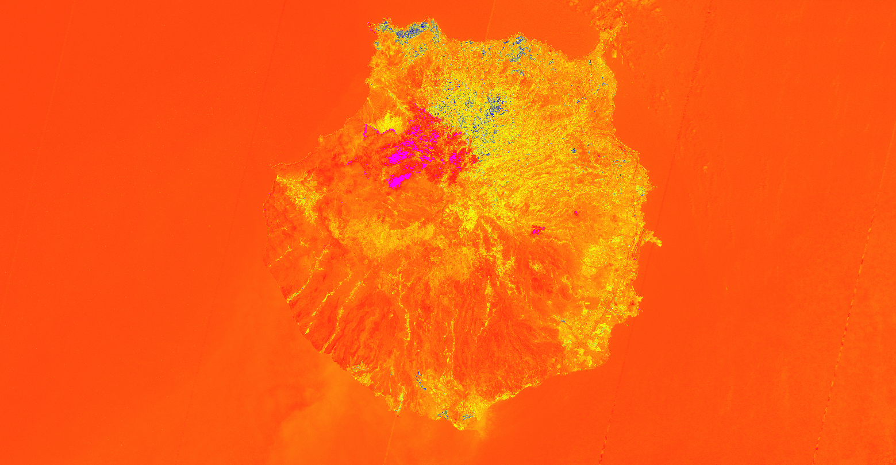

## General description of the script

BAIS2 adapts the traditional BAI for Sentinel-2 bands, taking advantage of the wider spectrum of Visible, Red-Edge, NIR and SWIR bands.

Values description: The range of values for the BAIS2 is -1 to 1 for burn scars, and 1 - 6 for active fires. Different fire intensities
may result in different thresholds, the current values were calibrates, as per original author, on mostly Mediterranen regions.

## Description of representative images

Burned area index, Las Palmas de Grand Canaria. Acquired on 19.08.2019.

