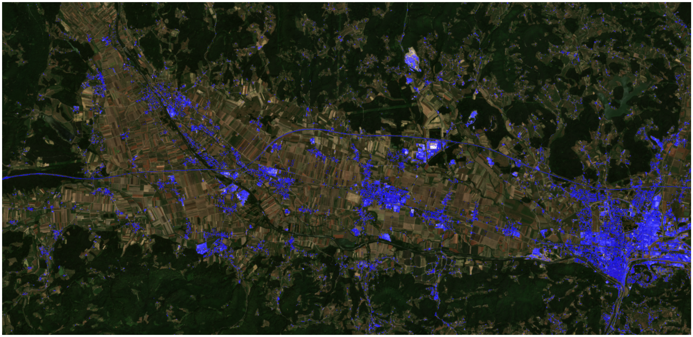

## General description of the script

The linked evalscript runs a prediction by a LightGBM classifier on the area-of-interest on L2A data. The pixel-wise probabilities are compared against a 0.8 threshold. Pixels with probabilities above this threshold are considered built-up (assigned a value of one), while others are non-built-up (assigned a zero). The mask is then expressed as a blue-tinted mask on Sentinel-2 True Color.

For detailed information about the model read the [blog post](https://medium.com/p/7f2d7114ed1c/).

## Author of the script

Matic Pečovnik, Sinergise

## Description of representative images

Built-up classifier mask script applied on Spodnja Savinjska Region, Slovenia.

Image taken on 29/06/2021.

