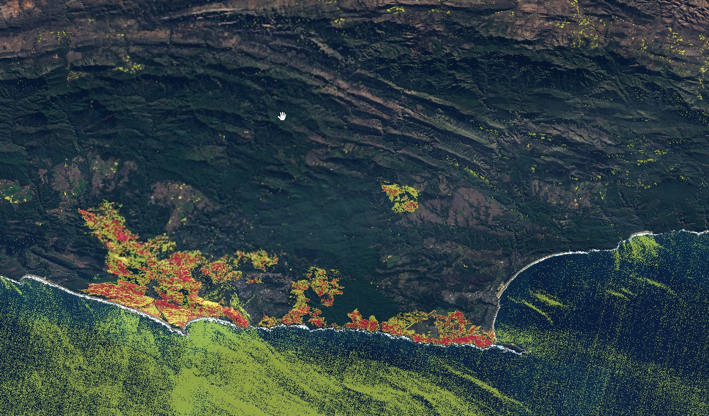

## General description of the script

The script takes two pre-defined dates as an input (in preProcessScenes) and calculates changes of the [normalised burn ratio index.](https://custom-scripts.sentinel-hub.com/sentinel-2/nbr/)

## Author of the script

Designed by [FC Basson](https://forum.sentinel-hub.com/u/fcbasson/summary) and improved by [@Pierre_Markuse and visually](https://twitter.com/Pierre_Markuse?ref_src=twsrc%5Egoogle%7Ctwcamp%5Eserp%7Ctwgr%5Eauthor)

## Description of representative images

Burned area analysis applied to the South African coast.

