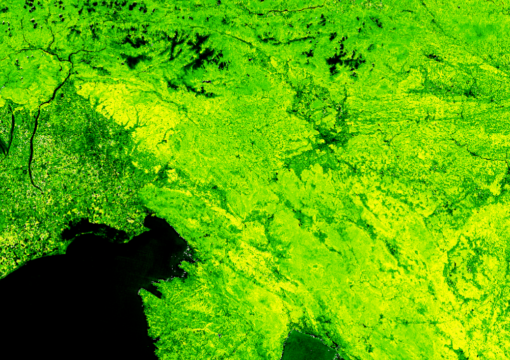

The index is based on [Gitelson et al. 2003](https://doi.org/10.1078/0176-1617-00887).

It is defined as:

$$ChlRe = \frac{NIR}{RE}-1.$$  

## Representative Images

Chlorophyl red edge above Slovenia and Croatia, on 9.7.2020. 

