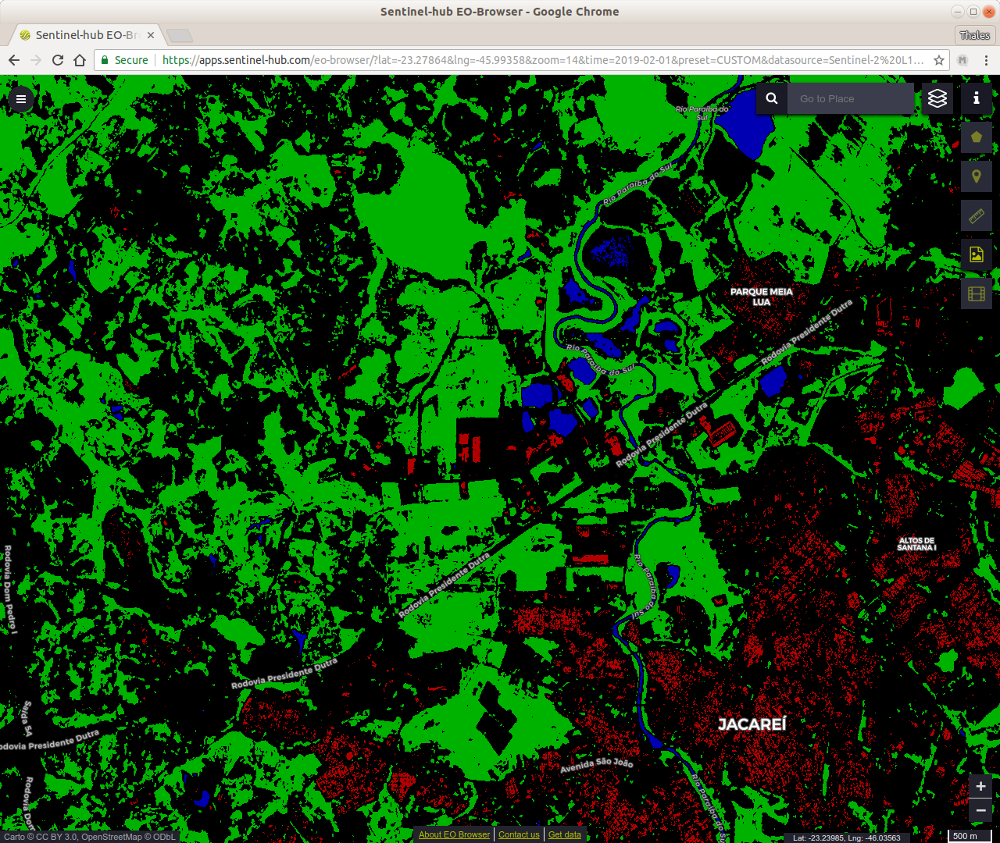
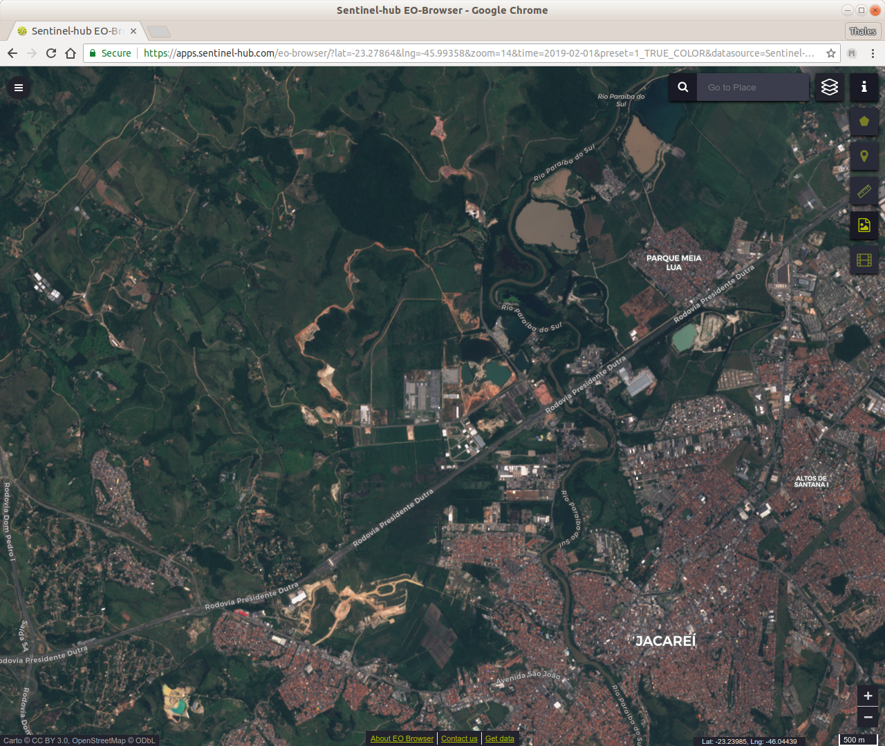
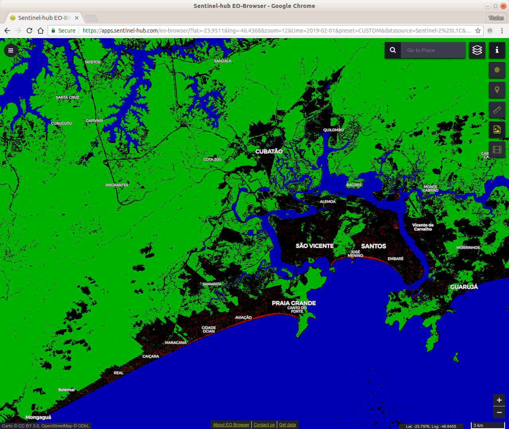
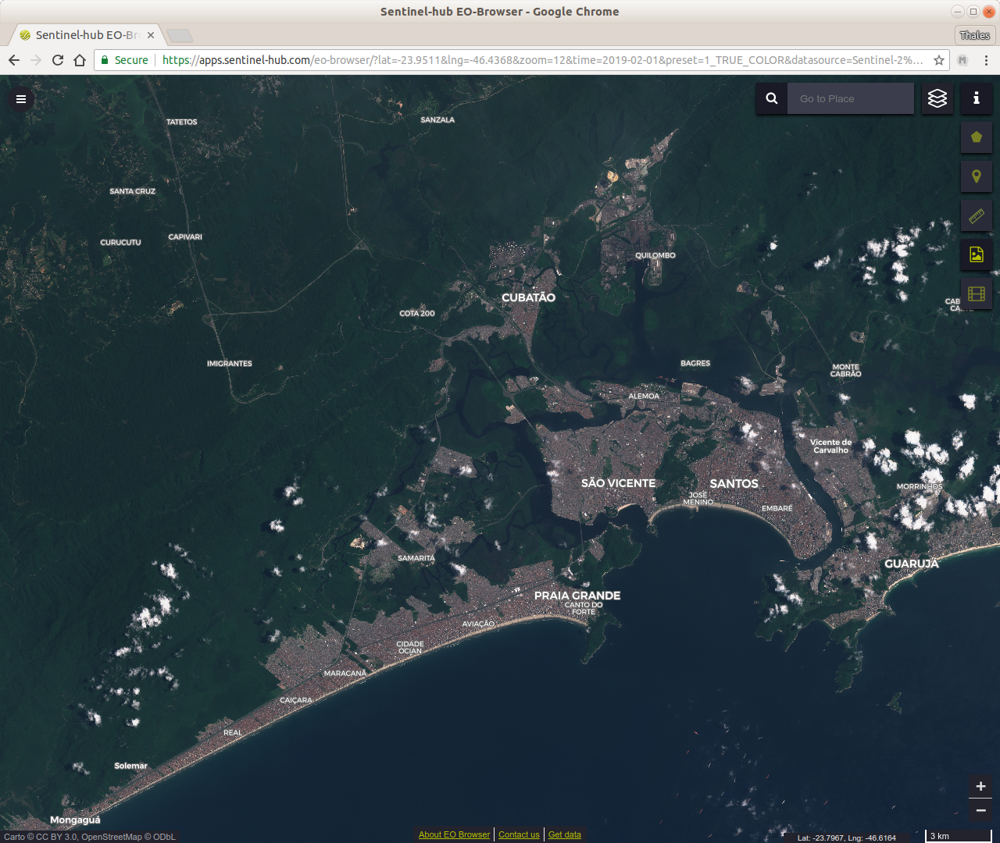

## General description of the script

This algorithm is a combination of 3 binary maps, based on the well known NDVI (Normalized Difference Vegetation Index), NDWI (Normalized Difference Water Index), band ratio and NDBI (Normalized Difference Built-up Index). Although we know that every location has a different behavior, we applied crisp thresholds to those indices (plus the ratio of visible bands). The thresholds were defined empirically.

The result is particularly useful for an overview of where are the cities, and their relations to water bodies and vegetation areas.

## Author of the script

Thales Sehn Koerting

## Description of representative images

Inserted are 2 examples:
- city highlights is the result of the script
- true color is showing the default true color representation of Sentinel Hub

Besides the 3 basic targets such as Rooftops, Vegetation and Water, it is possible to view the following in the results:

1. urban areas with rooftops and buildings in red
2. high probability of vegetation areas in green
3. rivers, pools and the sea in blue

Example 1

Since the thresholds were defined empirically, the author chose the more conservative way (some areas are omitted). The algorithm can be influenced by cloud shadow and also the countries coast.

Example 2

