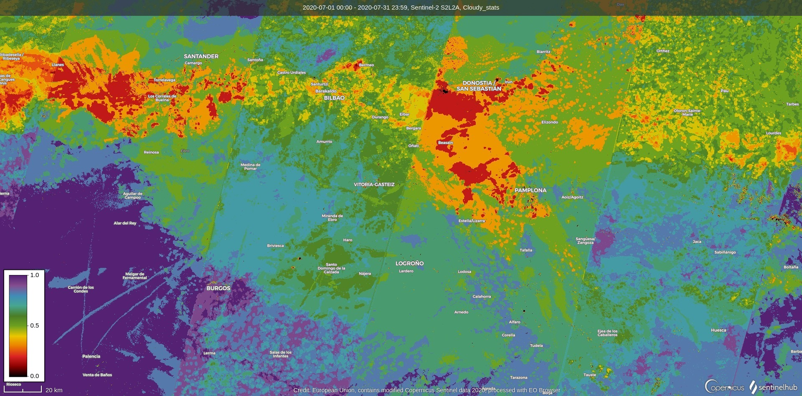

## General description of the script

For a given time-range, this script counts the number of Sentinel-2 L2A cloud-free pixels based on the [s2cloudless](https://medium.com/sentinel-hub/cloud-masks-at-your-service-6e5b2cb2ce8a) algorithm and the [Sen2Cor](https://step.esa.int/main/third-party-plugins-2/sen2cor/) scene classification (SCL) data. The SCL categories used to detect clouds in the current version of the script are:
- saturated/defective
- cloud shadow
- cloud medium probability
- cloud high probability
- cirrus.

The categories can be easily modified to fit users' needs. Furthermore, the SCL band can be removed from the script for compatibility with Sentinel-2 L1C images.

The script returns the ratio of cloud-free pixels against the total number of pixels over the time period.
## Description of representative images

The cloud statistics over the north of Spain for July 2020. The map shows a higher occurence of clouds along the North coastline (Asturias) than inland. Processed by Sentinel Hub.

*Above is an example output from the Cloud Statistics script: for each Sentinel-2 pixel, the values represent the ratio of cloud-free images over a given time period to the total number of images for the same period. Therefore, a value of 1 (represented in purple) means that 100% of the images in the time-series were cloud-free, and a value of 0 (in black) signifies that there are no cloud-free images available.*

**Note:** users are free to improve this page and modify any part of the script.
