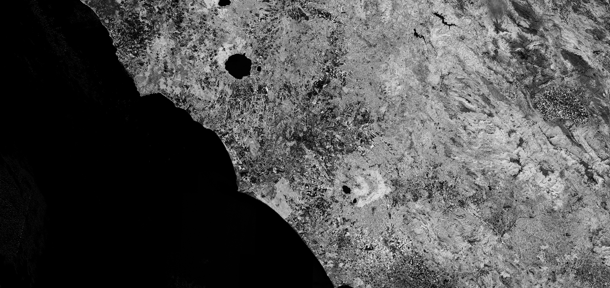

## General description of the script

FAPAR is the fraction of incoming solar radiation absorbed for photosynthesis by a photosynthetic organism (live leaves).

Note that the FAPAR script is as implemented in SNAP but without input and output validation!
Input/output values which are suspect are not reported or changed. Most values, however, do not fall under this category.
Visualized as an interval from 0-1. This can be adjusted in the evaluatePixel method.

## Description of representative images

FAPAR visualization of Rome. Acquired on 8.10.2017.

