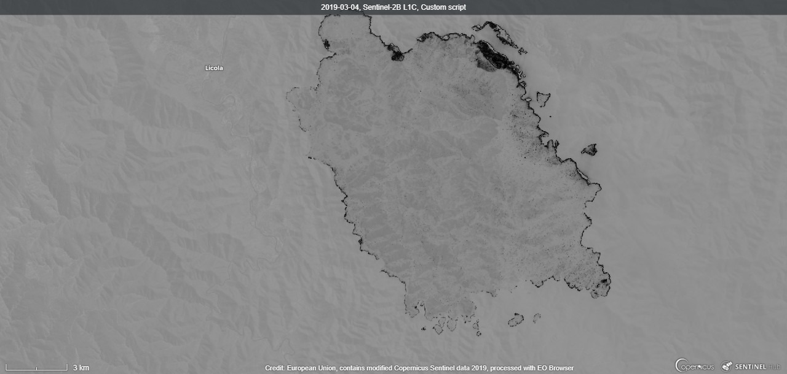

## General description of the script

The boundary of the affected wildfire area is important to understand the impact and measure the impact of the event. The existing script of wildfire boundary extraction still not be able to automatically delineate the boundary of the affected area.

This script is introduced to highlight the boundary of affected areas in more contrast and detail. Band 11 and Band 12 of Sentinel-2 is used. Using a higher coefficient number lead to more contrast visualization.

This script is benefiting not only for firefighters to manage the spread of fire but also for recovery management effort.

## Authors of the script

Adzanil Rachmadhi Putra
Fatwa Ramdani

## Description of representative images

This is the result of the script for the wildfire event of Melbourne, March 4, 2019.

