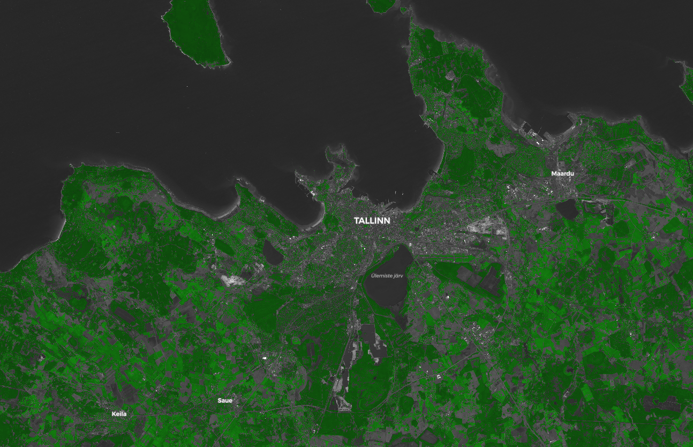
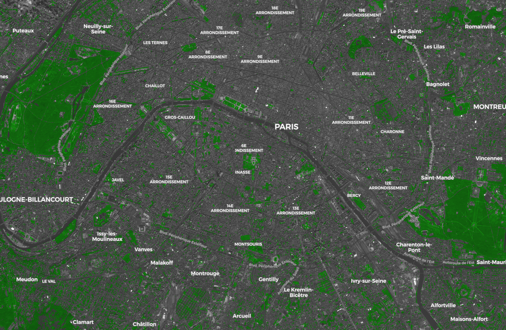
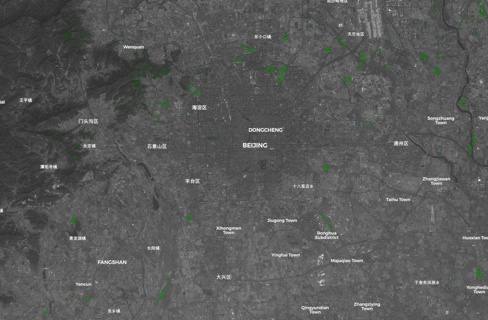

## General description of the script

Uses NDVI [1] to color Sentinel-2 images and create awareness of green areas in cities around the World.

## Author of the script

Carlos Bentes

## Description of representative images

Visualization of Tallinn with the Green City script.

Visualization of Paris with the Green City script.

Visualization of Beijing with the Green City script.

## References

[1] Normalized difference vegetation index:
https://en.wikipedia.org/wiki/Normalized_difference_vegetation_index

## Credits

Y. Zha, J. Gao & S. Ni (2003) Use of normalized difference built-up index in automatically mapping urban areas from TM imagery, International Journal of Remote Sensing, 24:3, 583-594, DOI: 10.1080/01431160304987
