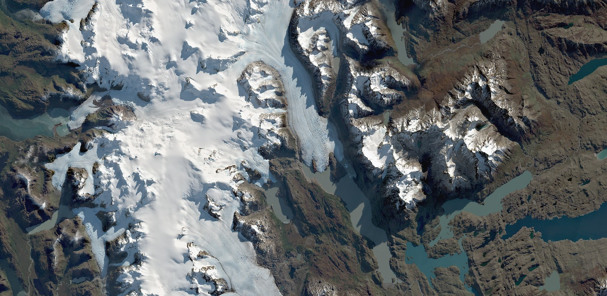

## General description of the script

This script aims to display the Earth in beautiful natural color images. It uses highlight optimization to avoid burnt out pixels and to even out the exposure. The script needs only 3 code lines and was inspired by the [Tonemapped Natural Color Script](https://custom-scripts.sentinel-hub.com/sentinel-2/tonemapped_natural_color/).

For Sentinel-2 L2A, the script applies the cubic root of the lowered values of the true color bands:

```javascript
return [Math.cbrt(0.6 * B04), Math.cbrt(0.6 * B03), Math.cbrt(0.6 * B02)];
```

For Sentinel-2 L1C, the contrast is additionally increased for better visualization:

```javascript
return [
    Math.cbrt(0.6 * B04 - 0.035),
    Math.cbrt(0.6 * B03 - 0.035),
    Math.cbrt(0.6 * B02 - 0.035),
];
```

## Author of the script

Marko Repše

## Description of representative images

Glacier Grey, Chile. Image acquired on 2019-05-08, processed by Sentinel Hub.


## Credits

- [Tonemapped Natural Color Script](https://custom-scripts.sentinel-hub.com/sentinel-2/tonemapped_natural_color/)
