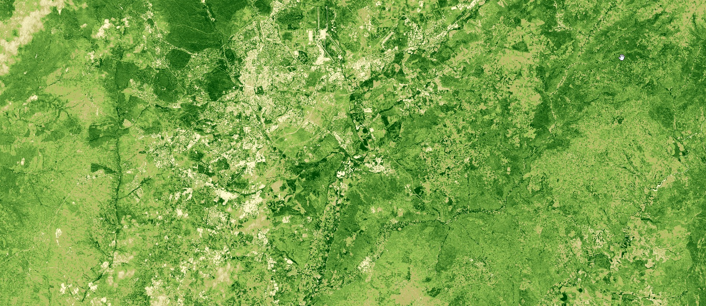

## General description

The script evaluates the NDVI for each scene of the past month and returns the highest NDVI value for every pixel. In short, it returns the highest NDVI values of the past month for every pixel. The script runs on-the-fly, since
it doesn't require preprocessing. It can be used as a cloud free background or an input for further analysis, such as change detection and classification. [Find out more.](https://www.sentinel-hub.com/max_service)  
Note that multi-temporal processing needs to be enabled for this script to run.

## Description of representative images

The max NDVI of Madrid, Spain. Acquired on 08.11.2019, processed by Sentinel Hub. 

