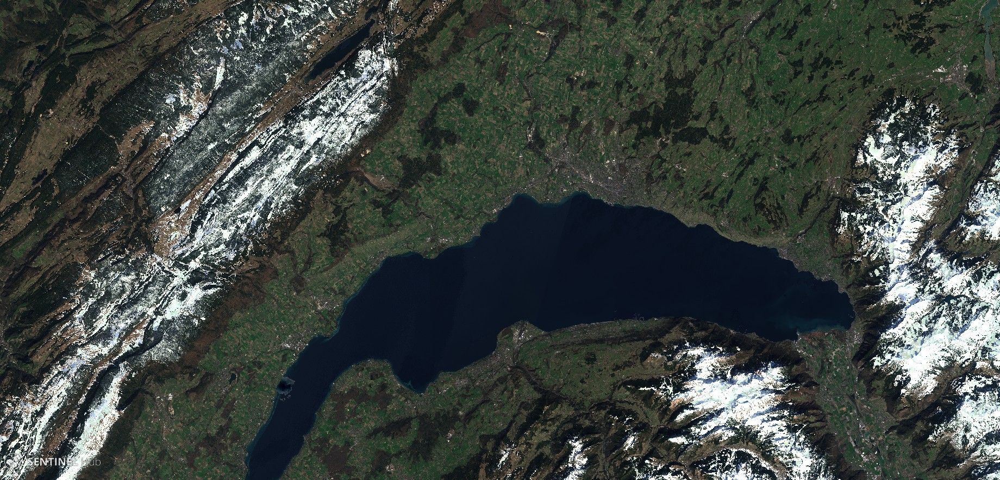
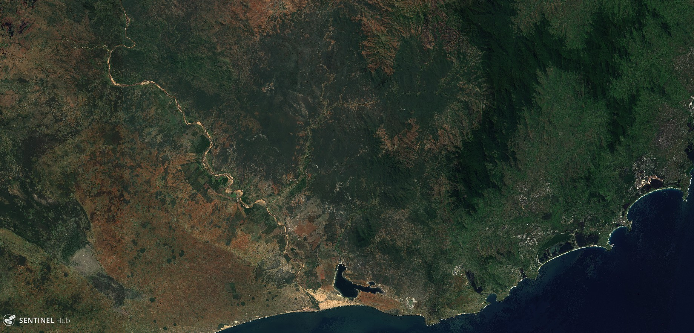
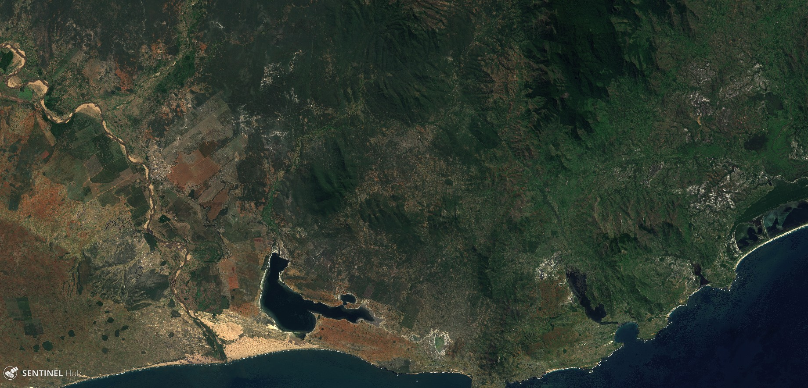
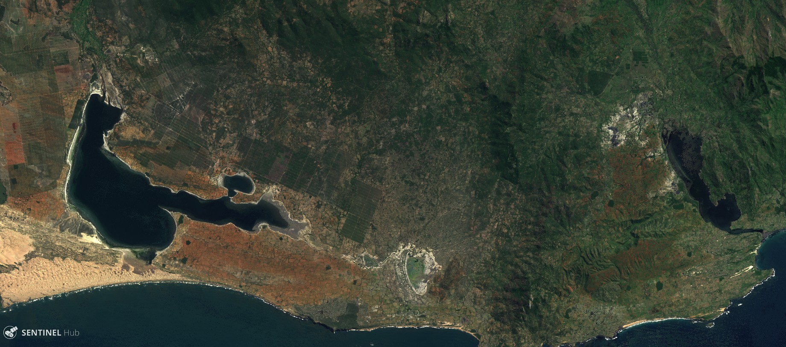

## General description of the script

Monthly composite (31 days before the chosen date), computed with best bands ratio. This script is here for those who want a cloud free image representing the last 31 days.

In order to select the best pixel in a month (and avoid cloud), a selection is made using a ratio :

- When blue < 0.12, date is chosen where max ratio of B08 against B02.
- If no pixel available above, when blue < 0.45, date is chosen where max ratio of B03 against B02.
- If water is detected, date is chosen where max ratio of B02 against B08.
- If snow is detected, median of scene with snow.

## Author of the script

Karasiak Nicolas

## Description of representative images

Lac léman, composite from 2019-03-29

South Madagascar, composite from 2019-04-26

See the [supplementary material](supplementary_material.pdf) for more examples.

## Credits

Thanks to :

- Pierre Markuse for his natural color script
- Harel Dan for his temporal script
