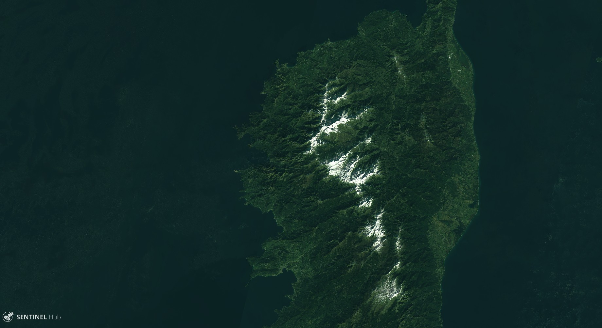
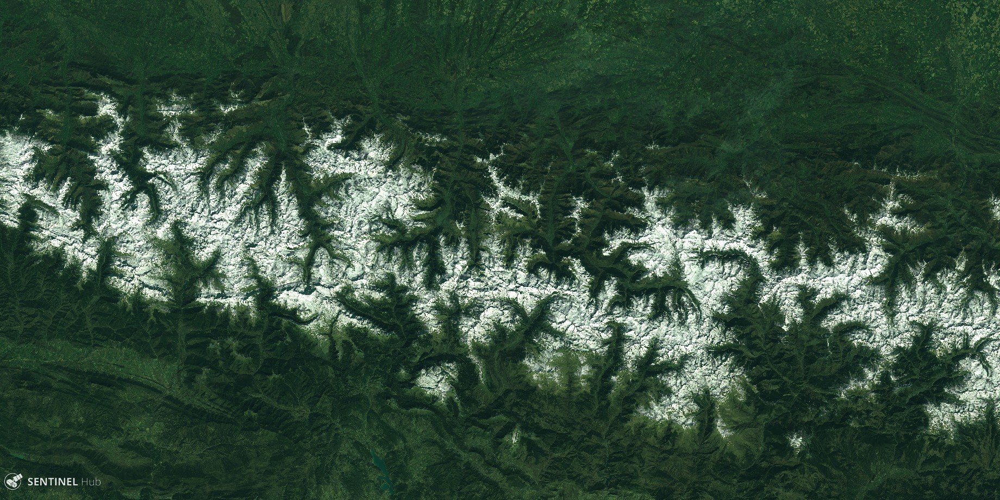
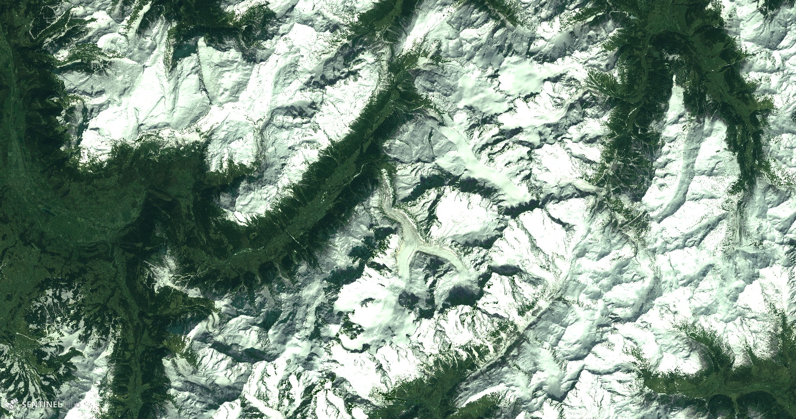

## General description of the script

Tired of waiting the perfect image with no cloud to show the snow cover?
This monthly snow report script is for you.

This code will find where the snow is persistent for the last 30 days (from the chosen date).
In order to well represent the land-cover, the script will store each pertinent date in a list and will represent the median value.

As the aim of the script is to represent the snow cover, all the other land-cover are saturated in green in order to easily see the snow.

The limitations are essentially:

- a few white rooftops
- when no uncloudy pixel is available in the previous 30 days

Thus, it is possible to make the script working with 90 days in order to have a trimonthly synthesis by changing settings to: "numberOfMonthsToUse = 3".

## Author of the script

Nicolas Karasiak

## Description of representative images

Persistent snow cover in February 2019 in Corsica

Persistent snow cover in Pyrénées in March 2019

Mer de Glace / Alpes persistent snow cover in the previous 30 days of 24 april 2019.

See the [supplementary material](supplementary_material.pdf) for more examples.

## Credits

- [Harel Dan temporal script](https://github.com/hareldunn/GIS_Repo/blob/master/Multi-Temporal%20NDVI%20for%20Sentinel%20Hub%20Custom%20Scripts)
- NDSI/red thresold was adapted from [here](https://www.cesbio.ups-tlse.fr/multitemp/?p=6446)
- [Snow representation by Simon Gascoin](https://apps.sentinel-hub.com/eo-browser/?lat=53.07650&lng=-6.21291&zoom=14&time=2019-02-02&preset=CUSTOM&datasource=Sentinel-2%20L1C&layers=B01,B02,B03&evalscript=Ly8gQ3VzdG9tIHNjcmlwdCBieSBTaW1vbiBHYXNjb2luCnZhciBjcDE9WzIuNSpCMDQsMS4yKkIwOCwxLjUqQjAyXTsKdmFyIGNwMj1bMS4xKkIwNCwxLjMqQjAzLDEuMSpCMDJdOwp2YXIgbmRzaT0oQjAzLUIxMSkvKDAuMDErQjAzK0IxMSk7CnJldHVybiAoKG5kc2k%2BMC4yKSYoQjAzPjAuMTUpKSA%2FIGNwMiA6IGNwMTs%3D)
