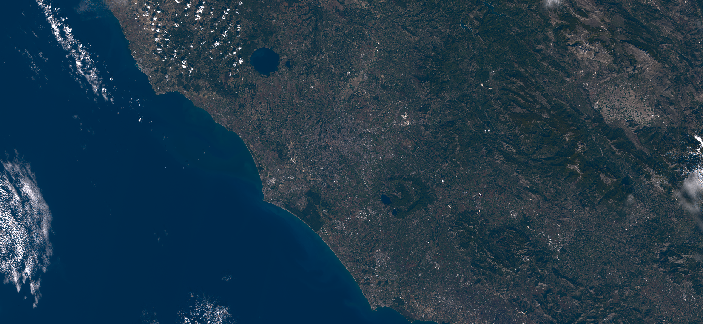

## General description
The natural color product tries to represent spectral responses of the satellite bands so as to match the color perceived by the human eye (see [1, 2] for details).

## Description of representative images

Natural color visualization of Rome, on 8.10.2017.

## References
 - [1] B. Sovdat, M. Kadunc, M. Batic, G. Milcinski, [Natural color representation of Sentinel-2 data](https://www.researchgate.net/publication/320042440_Natural_color_representation_of_Sentinel-2_data). Submitted.
 - [2] The accompanying [GitHub repository](https://github.com/sentinel-hub/natural_color).
