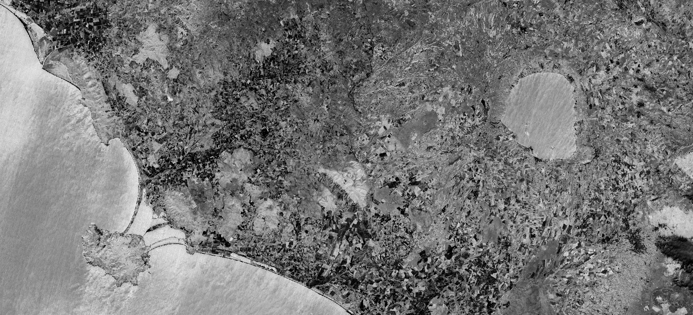

## General description of the script

To detect burned areas, the NBR-RAW index is the most appropriate choice. Using bands 8 and 12 it highlights burnt areas in large fire zones greater than 500 acres. To observe burn severity, you may subtract the post-fire NBR image from the pre-fire NBR image.

Values description: Darker pixels indicate burned areas.

**NBR = (B08 - B12) / (B08 + B12)**

## Description of representative images

NBR-RAW, Italy. Acquired on 08.10.2017, processed by Sentinel Hub.

