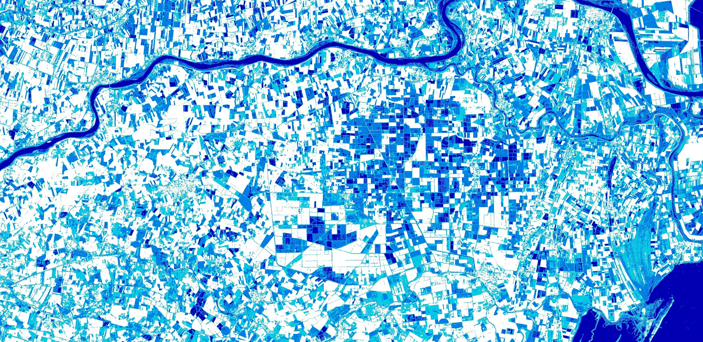

## General description of the script

The NDMI for moisture stress can be used to detect irrigation. It is based on the NDMI and visualized to 4 classes. For all the index values above 0, knowing the land use and land cover, it is possible to determine whether irrigation has taken place. The script should be used with Sentinel-2 bands B08 and B11, resulting in 10 m resolution.
Following this logic, while understanding land use and climate conditions of the area, it is possible to differentiate between productive and non-productive areas, as well as see how the different agricultural parcels reflect the index.
Based on our use-case, some of the parcels had high NDMI values in summer months after several weeks without rain. The only source of irrigation water was from an aquifer below. Since not all the parcels have water concessions, it was possible to identify illegal water use. Additionally, knowing the type of crop grown (e.g. citrus crops), it was possible to identify whether irrigation is being effective or not during the crucial growing summer season, as well as find out if some parts of the farm are being under or over-irrigated.

## Author of the script

Aferpo 83, Monja Šebela

## Description of representative images

The NDMI script applied to the Sentinel-2 image of northern Italy. Image acquired on 11.9.2019, processed by Sentinel Hub.

## Credits

[Read about the NDMI.](https://www.agricolus.com/en/indici-vegetazione-ndvi-ndmi-istruzioni-luso/)
