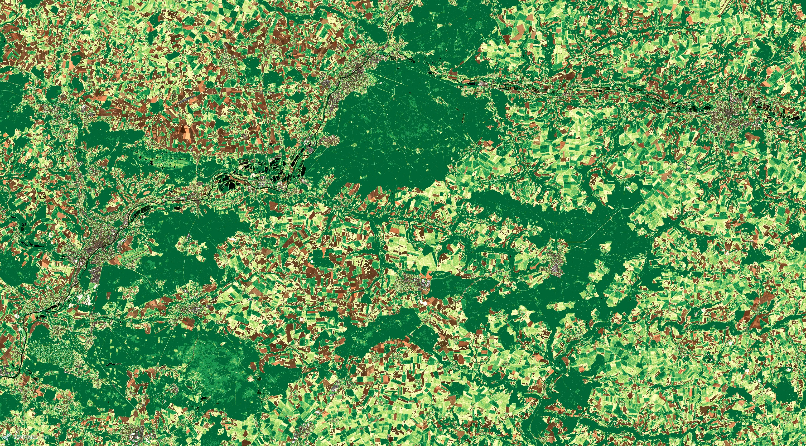
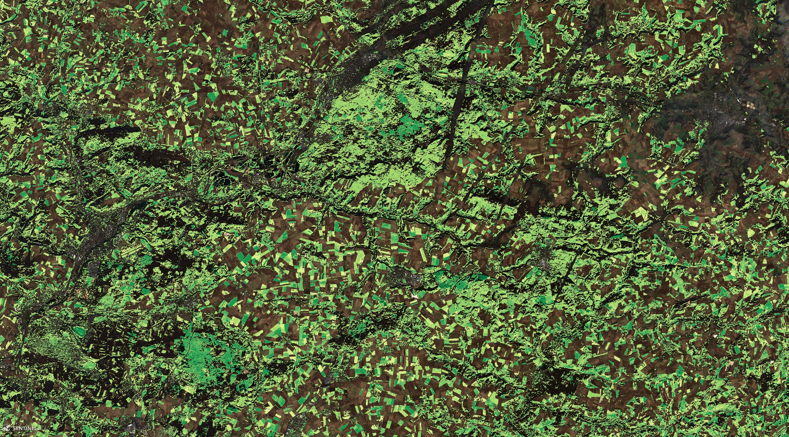
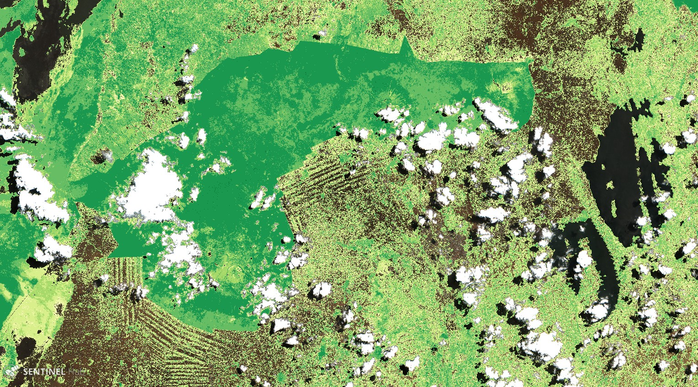
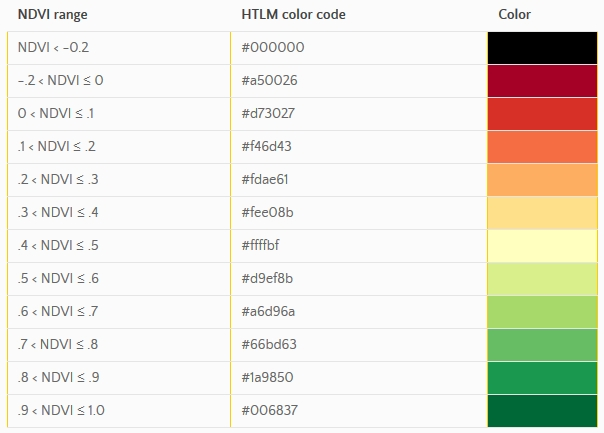

## General description of the script

This script works on Sentinel-2 L2A products, using the Vegetation class from the "Scene Classification map", to display a colour-coded normalized difference vegetation index, abbreviated NDVI, on pixels classified as vegetation and natural colours of surface reflectance (red = B04, green = B03, blue = B02) otherwise (water, clouds, snow, not-vegetated land pixels).

The normalized difference vegetation index, abbreviated NDVI, is defined as

$$NDVI = (B8A - B04) / (B8A + B04).$$

B8A band at 20 m resolution is used for NDVI computation as B8A spectral response is narrower than band B08 and less impacted by water vapour content.

It is an indicator of live green vegetation as described in [^1].

## Details of the script

Due to visualization issue with the Scene Classification Map this script performs better when displaying data close to the native pixel size with respect to screen size, therefore when the zoom level on bottom right of your EO Browser web window indicates a scale of 2 km or 3 km.

It works better in vegetated area without too many clouds however the L2A vegetation class is pretty reliable.
The natural colours visualisation is obtained with a gain of 3.0 optimized for the visualisation of surface reflectance:

```js
naturalColour = [3 * B04, 3 * B03, 3 * B02];
```

## Author of the script

Jérôme LOUIS

## Description of representative images

1. The two images of forest of Compiègne acquired 6 months apart (early summer vs early winter) show the difference of forest NDVI depending on the season.

The early summer image



The early winter image



2. The borders of the Virunga Park lying across the boundaries of three states (DRC, Ugunda, Rwanda) are clearly visible as the NDVI values differ between the Park and the surrounded areas more influenced by human land-use.



NDVI color legend



## Credits

This script is inspired by Custom script repository:

- ndviColorMap values taken from [NDVI script description](https://custom-scripts.sentinel-hub.com/sentinel-2/ndvi/)
- findColor function taken from Custom Processing Scripts documentation

## References

[^1]: Wikipedia, [Normalized Difference Vegetation Index.](https://en.wikipedia.org/wiki/Normalized_difference_vegetation_index) Accessed on January 21th 2020.
