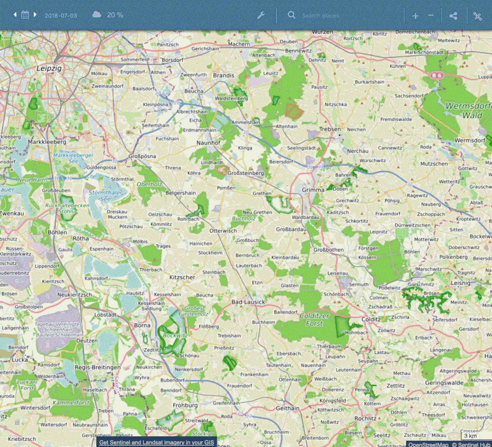

## General description of the script

The goal of the script is to calculate the "anomaly" of an index, avoiding clouds.

In this example, we use the NDVI index, but this can be easily changed.
We define here the anomaly of an index as the difference between the average index value during the current month, and the average of the index value, in the same month, over a defined number of years in the past (3 in our script, defined in the "nbPastYears" parameter). It is slightly different from the usual definition. We have included a constraint on the number of scenes of past years to be used to average each pixel. At least one for the current year, and 3 for the past years. This is the "currentIndexesMinValuesNumber" and "pastIndexesMinValuesNumber" parameters. In order to keep only the NDVI value of days without clouds in the scene, we use the Braaten-Cohen-Yang cloud detector. We exclude from the computation the days where the cloud is detected by the algorithm (it gives "yes/no" based on a threshold).
This can lead to excluding some snowing part, but this is not an issue: we are not interested in the NDVI of snow, anyhow.

See the [supplementary material](supplementary_material.pdf) for more details.

## Author of the script

Jean-Baptiste Pleynet

## Description of representative images

The following GIF is the NDVI Anomaly generated by Sentinel Hub using the script. It shows the peak (August) and the end (October) of the drought of summer 2018 in Germany in the region South of Leipzig.

## References

[Braaten-Cohen-Yang cloud detector](https://github.com/sentinel-hub/custom-scripts/tree/master/sentinel-2/cby_cloud_detection)
