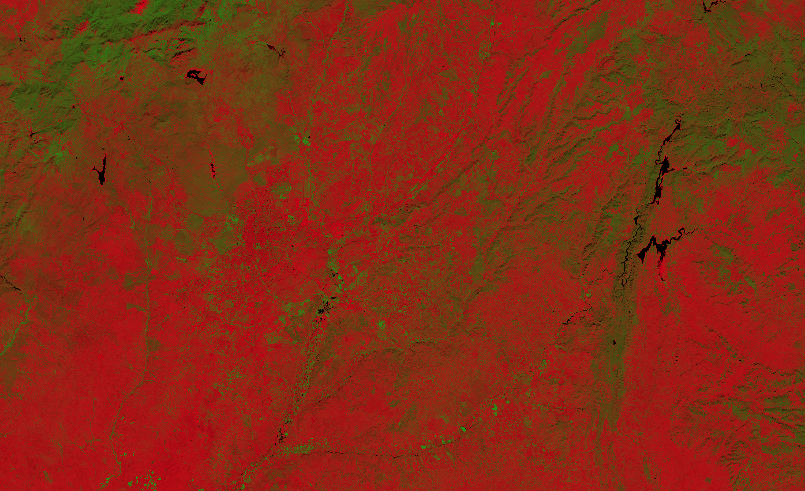

## Basic information
 - Bands used to calculate NDVI index: B4, B8
 - Bands used by the script: B2, B3, B4, B8

## General description

This script allows you to visually interpret how the normalized density vegetation index (NDVI) [^1] is affected by the uncertainties in detector reflectances of the L1C products.

Since NDVI is defined as a ratio of difference over sum of bands 8 and 4 (near infrared and red):   
$$NDVI := \mathtt{Index}(B8,B4) = \frac{B8-B4}{B8+B4}.$$

the uncertainty propagation [^3] gives us the uncertainty of the index itself as

$$\Delta_{NDVI} := \frac{\sqrt{B8^2 \Delta_{B4}^2 + B4^2 \Delta_{B8}^2 - 2B4 B8 \Delta_{B4B8}}}{(B8+B4)^2}$$.

where $\Delta_{B4}$ and $\Delta_{B8}$ are uncertainties of red and near infrared bands respectively (reported by ESA to be 0.02 and 0.03). We left out the mixed part $\Delta_{B4B8}$ as if the two uncertainties were not correlated.

The script encodes the uncertainty with darkness, as can be seen in following figure [^2]  
![Color map of the NDVI uncertainty script from [2][1]](fig/cmap.jpg)

## Description of representative images

NDVI with uncertainty of Madrid. Acquired on 10.26.2019.

## References

[^1]: Wikipedia, [Normalized Difference Vegetation Index
](https://en.wikipedia.org/wiki/Normalized_Difference_Vegetation_Index). Accessed on October 4th 2017.   
[^2]: Sentinel-Hub, [Ad hoc testing of algorithms globally](https://medium.com/sentinel-hub/ad-hoc-testing-of-algorithms-globally-8fb1f564f0f5). Accessed October 10th 2017.   
[^3]: Wikipedia, [Propagation of uncertainty](https://en.wikipedia.org/wiki/Propagation_of_uncertainty). Accessed October 10th 2017.
