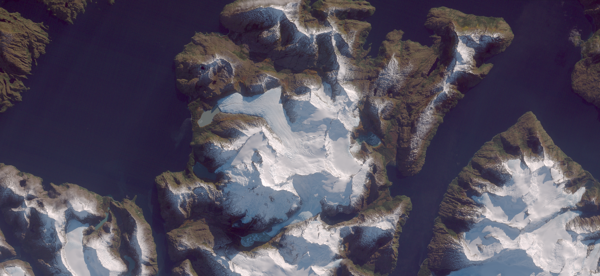

## Basic information

- Bands used by the algorithm: B2, B3, B4
- Parameters:
    - **c0r**: atmospheric correction offset in red band B4
    - **cManual**: (optional) manual offsets for r,g,b bands; may include manual scale factors as well
    - **tx, ty**: position of the mid-point of the envelope for the levels color adjustment curve
    - **max**: maximal band value (after atmospheric compensation), to be rendered as white
    - **sat**: saturation enhancement, applied after levels adjustment
    - **debug**: set to false to highlight pixels where any component is outside the interval `[0..1]`
    - **atmRatios**: band offset ratios to use with single-parameter atmospheric correction (defaults are derived from Rayleigh scattering)

## General description

The product produces natural color images using Sentinel-2 bands 4, 3 and 2. It performs a very basic linear atmospheric correction, and applies a curve to the color components to enhance details in the dark areas, while preserving contrast in very bright snow-covered slopes. It has been fine-tuned to use on the Sentinel-2 image of Monte Sarmiento in Tierra del Fuego taken 2016-05-05.

## Description of representative images

Color correction over Tierra del Fuego. Acquired on 2018-04-27.

## References

- Sentinel Hub Blog, [Color Correction with Sentinel Hub](https://medium.com/p/d721e12a919).
