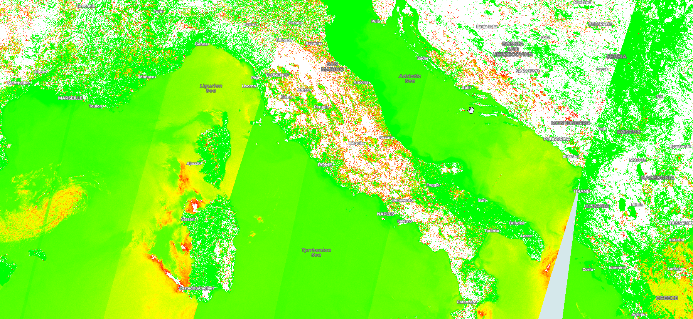

## General description of the script
The red edge position index is sensitive to changes in chlorophyll concentrations, as higher chlorophyll concentrations absorb longer wavelengths. It is calculated as: 700+40*((670nm+780nm/2)-700nm/(740nm-700nm)

## Description of representative images

Visualization of the REPO index above Italy.

## Credits

The script is based on [Gholizadeh et al., 2016.](https://www.mdpi.com/1999-4907/7/10/226)
It is described in the [Index database](https://www.indexdatabase.de/db/i-single.php?id=196) as well.
