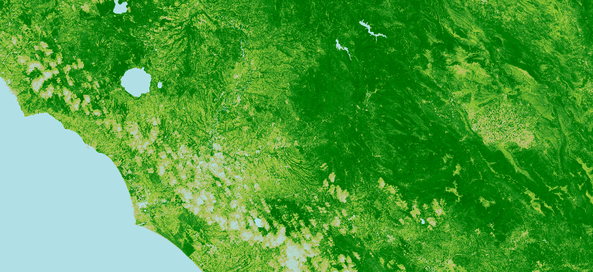

## General description of the script

For Sentinel-2, the index looks like this:

$$SAVI = \frac{B8-B4}{B8+B4+L} \cdot (1+L)$$ 

where $L$ is the soil brightness correction factor and could range from (0 -1).

Empirically derived NDVI products have been shown to be unstable, varying with soil colour, soil moisture, and saturation effects from high density vegetation. In an attempt to improve NDVI, Huete [^1] developed a vegetation index that accounted for the differential red and near-infrared extinction through the vegetation canopy. The index is a transformation technique that minimizes soil brightness influences from spectral vegetation indices involving red and near-infrared (NIR) wavelengths.

## Description of representative images

SAVI visualized image, Italy. Acquired on 25.05.2020, processed by Sentinel Hub. 

## Contributors:

Dorothy Rono

## References

[^1]: [Wikipedia article on Soil adjusted vegetation index](https://en.wikipedia.org/wiki/Soil-adjusted_vegetation_index)
