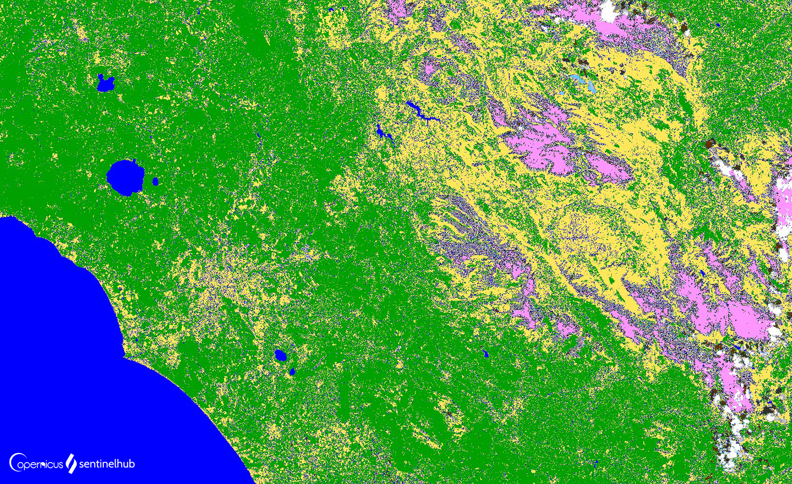

## General description

Scene classification was developed to distinguish between cloudy pixels, clear pixels and water pixels of Sentinel-2 data and is a result of the Scene classification algorithm run by ESA. Twelve different classifications are provided including classes of clouds, vegetation, soils/desert, water and snow. It does not constitute a land cover classification map in a strict sense.

## Description of representative images

Scene Classification of Rome. 

## Color legend
| Value | Scene Classification | HTLM color code | Color | 
|-------|----------------------|-----------------|-------| 
| 0 | No Data (Missing data | #000000 | !#000000 |
| 1 | Saturated or defective pixel | #ff0000 | !#ff0000 |
| 2 | Topographic casted shadows (called "Dark features/Shadows" for data before 2022-01-25 | #2f2f2f | !#2f2f2f |
| 3 | Cloud shadows | #643200 | !#643200 |
| 4 | Vegetation | #00a000 | !#00a000 |
| 5 | Not-vegetated | #ffe65a | !#ffe65a |
| 6 | Water | #0000ff | !#0000ff |
| 7 | Unclassified | #808080 | !#808080 |
| 8 | Cloud medium probability | #c0c0c0 | !#c0c0c0 |
| 9 | Cloud high probability | #ffffff | !#ffffff |
| 10 | Thin cirrus | #64c8ff | !#64c8ff |
| 11 | Snow or ice | #ff96ff | !#ff96ff |

## References

- [ESA, Level-2A Algorithm Overview](https://sentinels.copernicus.eu/web/sentinel/technical-guides/sentinel-2-msi/level-2a/algorithm-overview)
