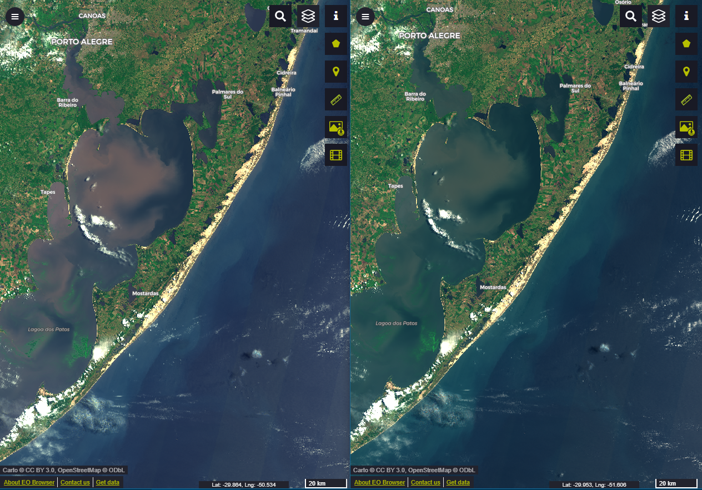
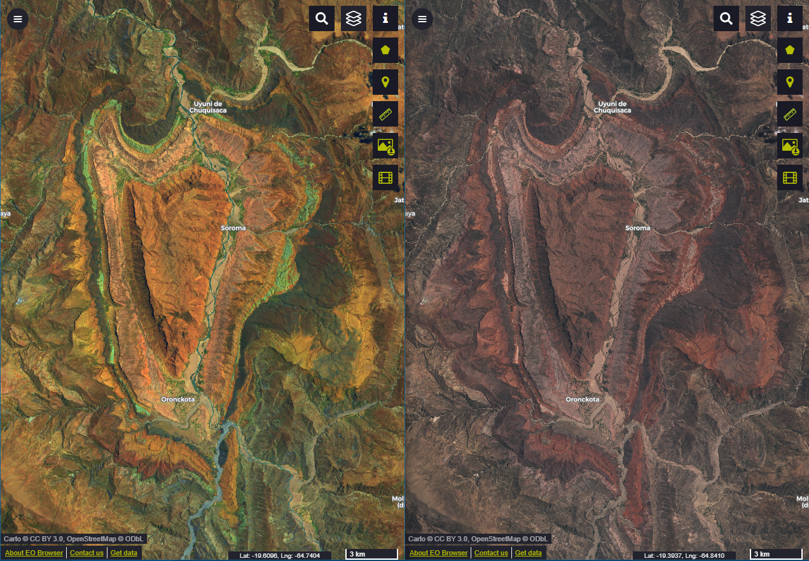
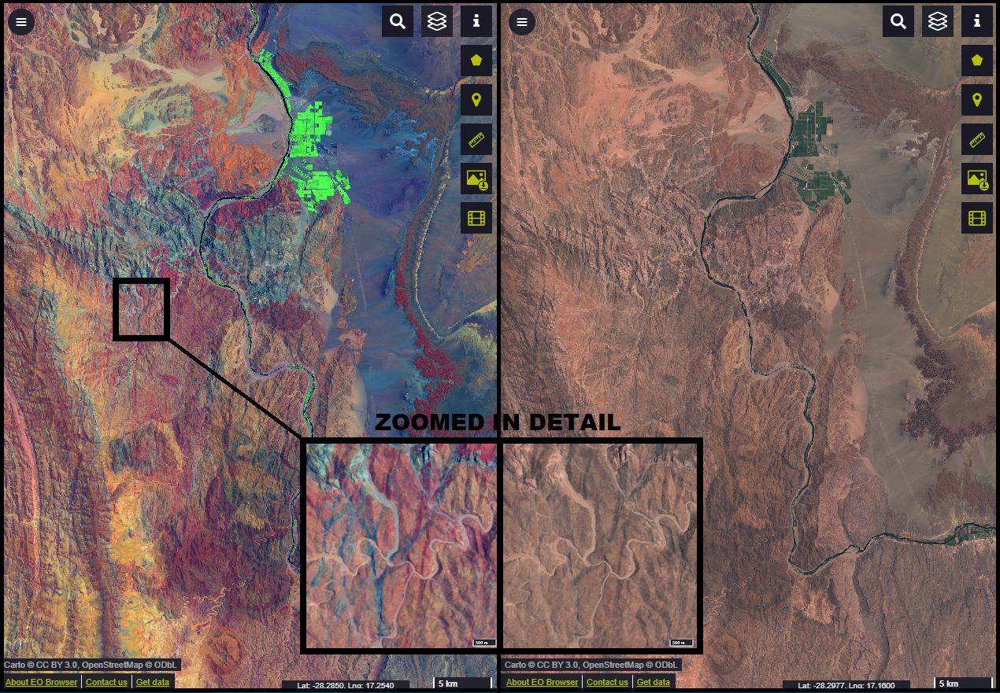
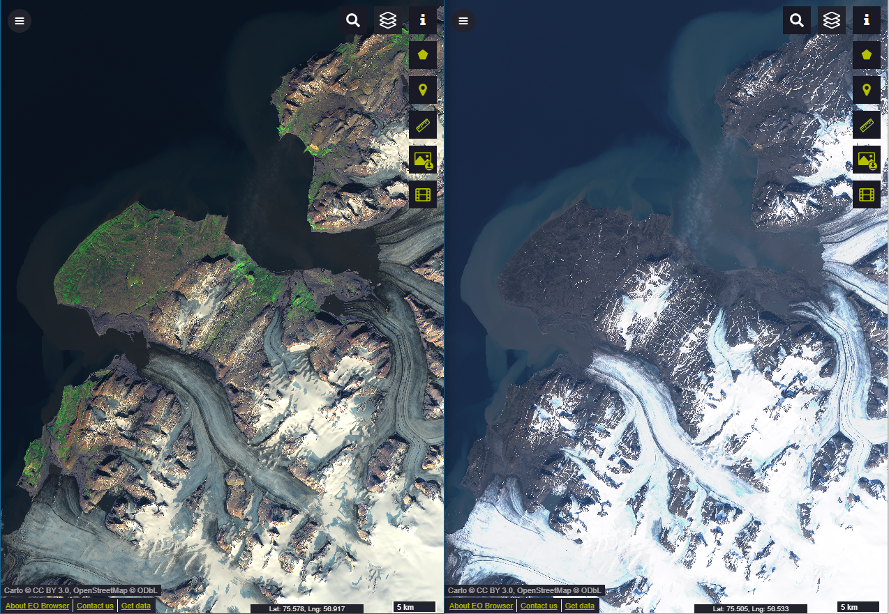
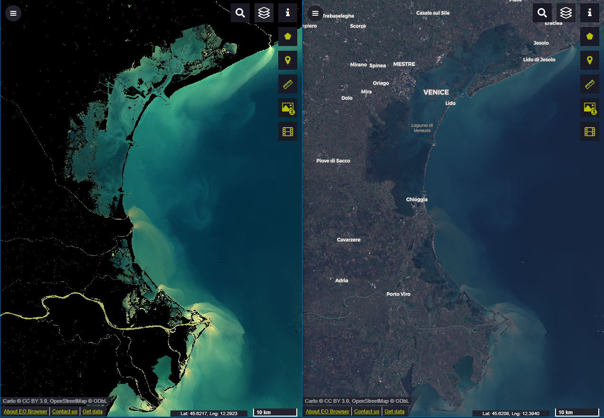

## General description of the script

Interactive enhancement dual mask to alternate selective treatment of features, like Land x Water or Snow or Vegetation, based respectively on NDWI, NDSI and NDVI indices, for Sentinel-2 images.

## Details of the script

**Scripts applicability**
The objective of this script is to help on selectively enhancing of different classes of indexed features in images.
In most occasions a single composition of band, or luminosity adjustments, does not fit to all features of an image. Actually, when enhancing some features, others often fall negatively influenced. For example, this may happen when enhancing bare soil, geology and vegetation differentiations using SWIR B12, B11, as RED, causing water to loose differentiation of turbidity that B04 Natural Red can detect very well. This SWIR effect was the case that can be seen in the example of Picture 1 below. Also when dealing with very different exigencies for luminosity adjustment, like between soil and snow.
So strategically treating both separately may help to preserve such kind of particular details of each group of features.
This script also aims to be didactically clear, simple and easy to manipulate, to be understood by beginners, since it's recommended user actions on adjusting parameters (even though parameters have default presets).

**False detection problems**
It was found that clouds over water may be not well selected when using NDWI, some falling apart from water, others keeping on water's group of selection. It can't be provided just one single stablished enhancement adjust to fitting all places, all situations. Limit values of Indices, as well compositions of bands, may be adjusted to avoid affect undesirable features.

**How the script works**
This script discriminates images in two opposite group of features, according to the limit value of selected remote sensing indices (NDWI,NDVI,NDSI; eventually others may be added to the list).
This limit separates images in two classes of features, each group being treated separately, like a selection mask, i.e., verse and inverse selection areas of the same limit value, both summed fitting the whole image area.
Then, for each selection group, it applies contrast stretch and saturation separately.
Each selected area can be individually blacked out, for exclusive visualization of the opposite selection.
Also each one can be fully desaturated to monochromatic. This can be useful as another selective enhancement resource.

Parameters for contrast, saturation, index limit and band compositions may be manually adjusted.

## Author of the script

Sérgio Augusto Jardim Volkmer

## Description of representative images

1. Visualization of BRAZIL, Lagoa dos Patos, RS dry season 2020-01-10

LEFT: Using separated enhancement for land and water:

- Land, using "NATURAL_SWIR" [(B04*2.6+B12*0.8), (B03*3.0+B08*0.5), (B02*3.0)], enhances both vegetation, farmlands, bare soil;
- Water, using "NATURAL_REDGE" [(B04*4.0), (B03*2.8+B06*1.5), (B02*3.5)], enhances turbidity moistures and algae in it.

RIGHT: Using only NATURAL_SWIR for both land and water: enhances land, but loses differentiation of water, turbidity moistures, algae.

2. Visualization of BOLIVIA, Pucara de Oroncota 2019-11-02

LEFT: Script highly enhances geology differentiation, while selectively enhancing waterways.

RIGHT: True Color shows not much differentiation in geology itself, and with waterways, all in similar colors.

3. Visualization of NAMIBIA, Aussenkehr Farm 2020-01-09

LEFT: Enhanced geology differentiation, magmatic dikes (bluish-grey) cutting through different rock layers, while selectively enhancing farmlands.

RIGHT: True Color, indiferentiated geology, magmatic dikes not visible.

4. Visualization of RUSSIA, Severny Island on summer 2019-08-20

LEFT: Different treatement of brightness and contrast for snow and glaciers versus land , vegetation and rocks.

RIGHT: True Color highly oversaturated whitness of snow an glaciers and no differentiation of vegetation and soil.

5. Visualization of ITALY, Golfo di Venezia 2019-11-10

LEFT: Using selection as an artistic blackout mask to enhance water turbidity alone.

RIGHT: True Color with much less differentiation of clear water and turbidity.

## References

For limit values of Indices:
[1] [NDSI: (B03-B11)/(B03+B11) > 0.42 for snow areas and glaciers](https://custom-scripts.sentinel-hub.com/sentinel-2/ndsi/)

[2] [NDVI: (B08-B04)/(B08+B04) > 0.2 for grass, shrub; > 0.4 dense forest](https://en.wikipedia.org/wiki/Normalized_difference_vegetation_index)

[3] [NDWI2: (B03-B08)/(B03+B08) > 0.3 for water bodies](https://en.wikipedia.org/wiki/Normalized_difference_water_index)

## Credits

[1] Selective treatment logics based on Simon Gascoin's [Better snow visualisation using NDSI](https://www.sentinel-hub.com/contest)

[2] Enhancement functions based on Pierre Markuse's [Wildfire visualization](https://custom-scripts.sentinel-hub.com/sentinel-2/markuse_fire/)
