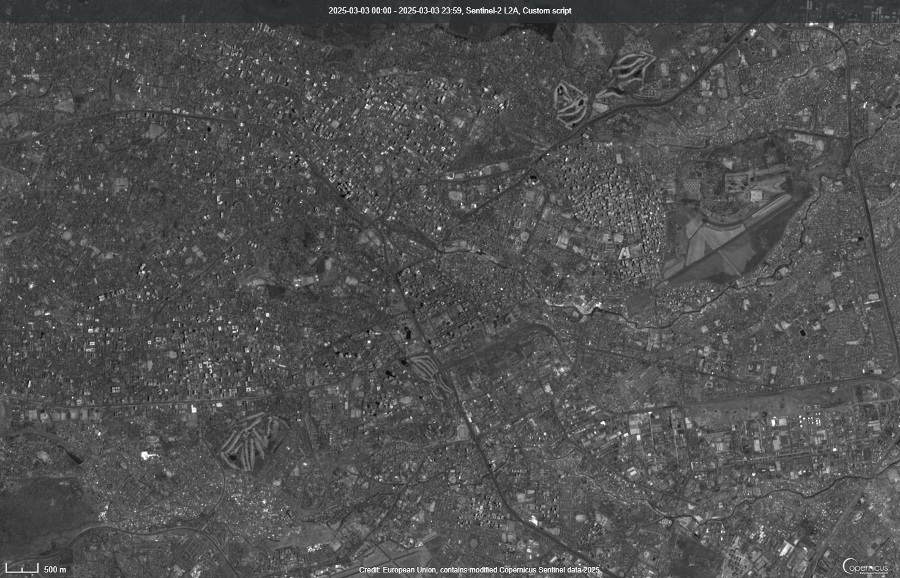

## General description of the script

This script is for creating a simple panchromatic greyscale visualization from Sentinel-2. It simulates the way a panchromatic band works by taking the average of bands 2 (Red), 3 (Green), 4 (Blue), and 8 (wide-band near infrared). The suggested use is for backgrounds in a scene compare, or as an input for pansharpening of lower resolution bands. The script also works for quarterly cloudless mosaics. Using the "opacity" function in compare mode and a panchromatic Sentinel-2 cloudless mosaic as a background, you can make the interpretation of low-resolution datasets such as Sentinel-3 or Sentinel-5P imagery a lot easier.

## Description of representative images

This scene is a Sentinel-2 image of Nairobi, Kenya

