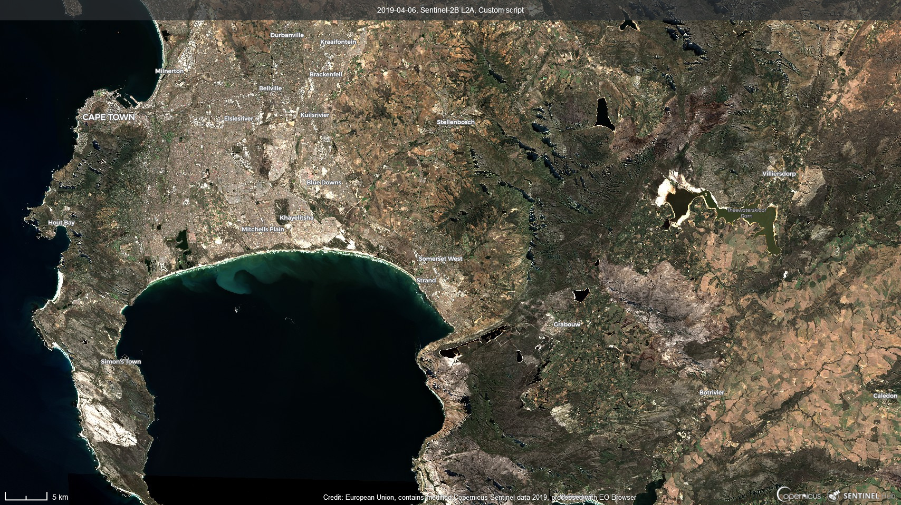
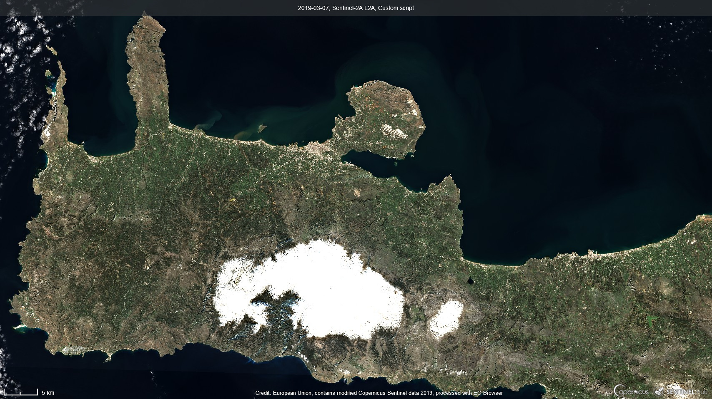
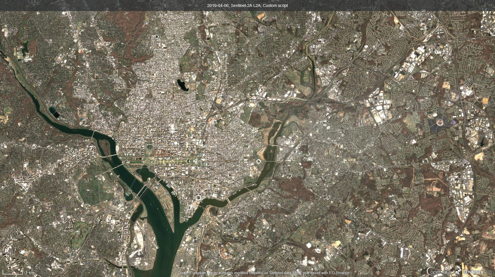
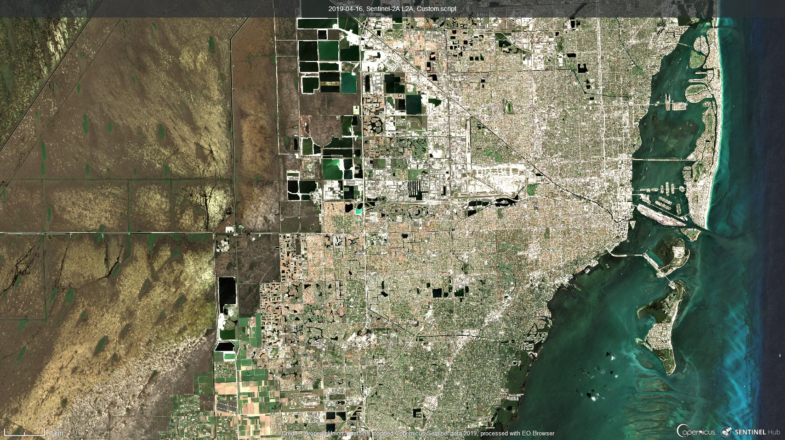

## General description of the script

This script works on urban areas and lands giving a similar view to the near-infrared but looking for some true color.

## Author of the script

Leo Tolari

## Description of representative images

This script wants to be a view with true colors exploiting near infrared and long infrared.

