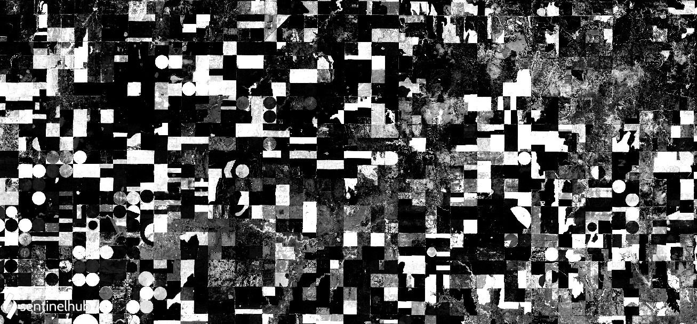

## General description of the script

The vegetation condition index [1] compares the NDVI at current (observed) time to historical values, i.e. to NDVI at similar dates in previous years:

VCI = (NDVI_observed - NDVI_hist_min) / (NDVI_hist_max - NDVI_hist_min)

Please note that in case of Sentinel 2, only a few years of history are available.

The script takes the newest (latest) available scene as the observed one. Then, for each previous year the script finds all values within `toleranceDays` of the most recent date.

The actual scenes (dates) used can be returned as meta-data with an API requests by replacing the `responses` part of the request with:

```json
  "responses":  [{
    "identifier": "userdata",
    "format": { "type": "application/json" }
  }]
```

Example response:

```json
{
    "historical": [
        "2018-09-08T00:00:00.000Z",
        "2016-09-13T00:00:00.000Z",
        "2015-09-09T00:00:00.000Z"
    ],
    "observed": "2019-09-13T00:00:00.000Z"
}
```

## Description of representative images

Vegetation condition index near Dodge City, Kansas, USA. Acquired on 30.05.2020.



## References

[1] https://www.indexdatabase.de/db/i-single.php?id=249
