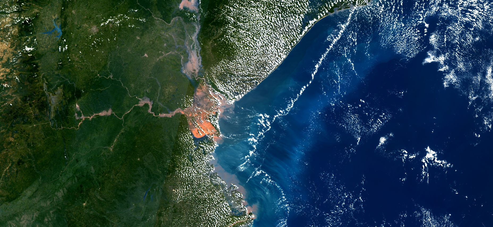

## Description
This script offers different true color visualizations, a NIR visualization, and the ability to easily add more visualizations. Variables allow you to influence the resulting image regarding, brightness, contrast, and saturation.  

## Description of representative images

Mozambique floods, 25.3.2019. 

## Contributors:
Pierre Markuse

## License
[CC BY 4.0 International](https://creativecommons.org/licenses/by/4.0/)
