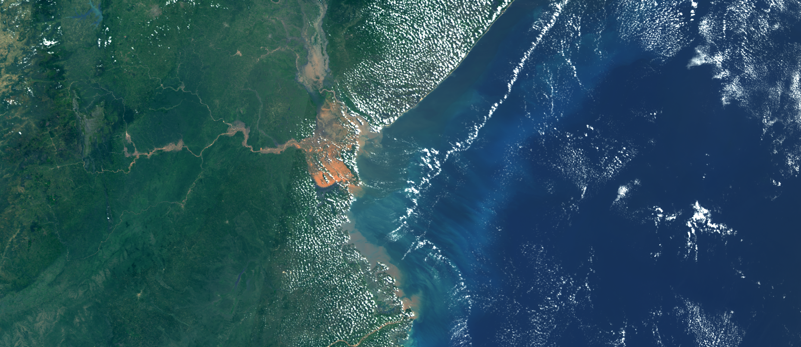

## Description

This script offers enhanced true color visualizations.

## Description of representative images

Enhanced true color visualization of Beira, Mozambique. Acquired on 25.03.2019.

## Contributors:

- Annamaria Luongo, [LinkedIn](https://www.linkedin.com/in/annamaria-luongo-RS)

## License

- [CC BY 4.0 International](https://creativecommons.org/licenses/by/4.0/)
