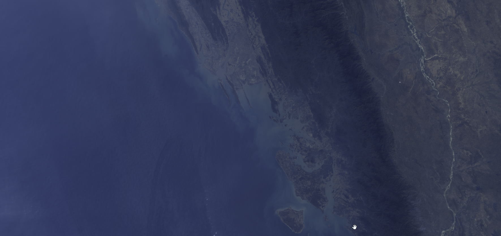

## Description

The colours from natural waters differ markedly over the globe, depending on the water composition and illumination conditions. The space-borne “ocean colour” instruments are operational instruments designed to retrieve important water-quality indicators, based on the measurement of water leaving radiance in a limited number (5 to 10) of narrow (≈10 nm) bands.

The derivation of the true colour of natural waters is based on the calculation of the Tristimulus values that are the three primaries (X, Y, Z) that specify a colour stimulus of the human eye. On how tristimulus is calculated, read [here.](https://www.ncbi.nlm.nih.gov/pmc/articles/PMC4634488/)

## Description of representative images

Tristimulus water colors at west coast of Myanmat. Acquired on 27.01.2020, processed by Sentinel Hub.

