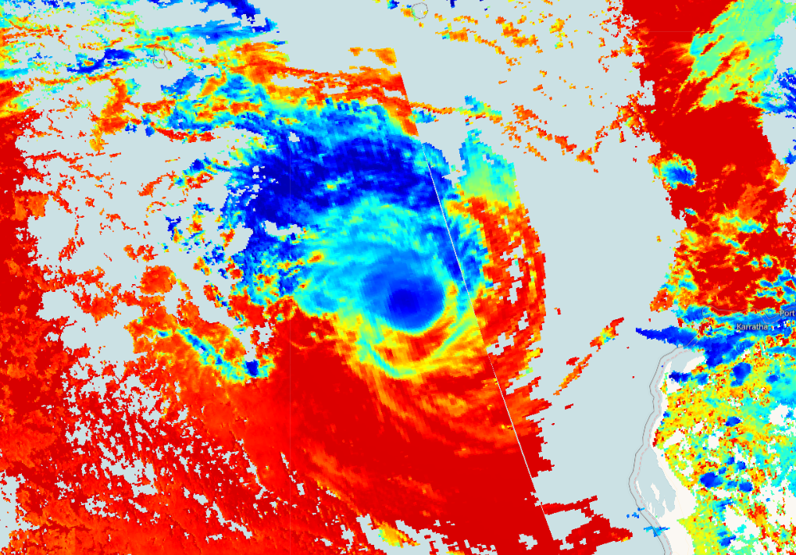

## Description
This script visualizes Sentinel 5P base pressure product (air pressure measured at the base of a cloud in Pascal (Pa)).

## Description of representative images

Cloud top pressure of the Pacific Ocean hurricane, 2020-01-15.

