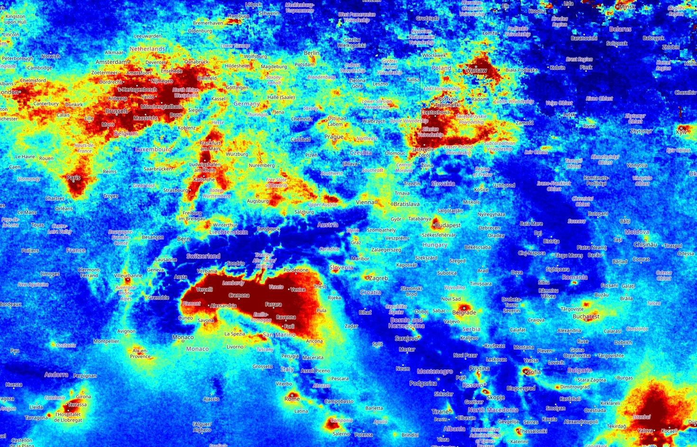

## General description of the script

This script calculates the mean values of NO~~2~~ over the time period you select. It is useful for visualizing large-scale patterns of air pollution.
In order to comply with the SI unit definitions, the TROPOMI NO2 data product gives trace gas concentrations in mol/m^2^.

Cloud-affected pixels are masked from Sentinel-5P air pollution imagery, you will see them as empty pixels on the map. Due to the relatively low resolution of Sentinel-5P TROPOMI, these datasets work best at regional to continental scale, however, at such scales it is extremely rare to encounter an image that is not influenced by clouds. Therefore, similar to [Sentinel-2 quarterly mosaics](https://dataspace.copernicus.eu/news/2024-2-27-exploring-new-frontier-sentinel-cloudless-mosaics-copernicus-data-space-ecosystem), creating longer-term mean mosaics of Sentinel-5P data enables exploring pollution patterns across regions.

The script is written to work for NO2, but can be used for other Sentinel-5P data layers as well by manually changing the variable "NO2" in the setup function and in the sum(array) function.

## Representative image

This image shows the monthly mean NO2 concentration for January 2024 over Central Europe. You can see the major urban centers of Northern Germany, Belgieum and the Netherlands, the Rhine valley, the Czech basin, and the high pollutant concentration in the Po valley.

View in Copernicus Browser [here](https://tinyurl.com/europesen5p)

## References

- [Sentinel-5P TROPOMI NO2 data products Algorithm Theoretical Basis Document](https://sentiwiki.copernicus.eu/__attachments/1673595/S5P-KNMI-L2-0005-RP%20-%20Sentinel-5P%20TROPOMI%20ATBD%20NO2%20data%20products%202022%20-%202.4.0.pdf?inst-v=9aab56a9-2b0f-4066-9dbe-4985b055a039)
