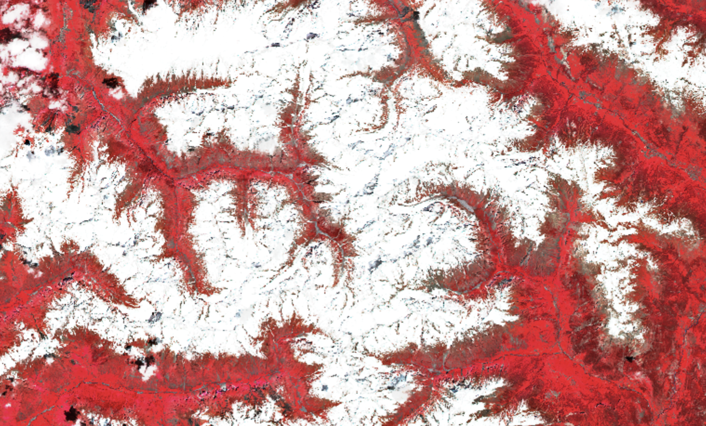

# Example product

<!-- Example Copernicus Browser link. Replace the URL inside the parentheses with the actual link when available. -->

[Copernicus Browser link]()

## Scripts

| Script                                         | Short description                               |
| ---------------------------------------------- | ----------------------------------------------- |
| [Give your script a name](./scripts/script.js) | Provide a short description of your script here |

## General description of the script

Write a general description of your script here.

## Description of representative images

You can add an image here and describe it.

## References

- possible references (scientific articles, wiki/web references, ...)
