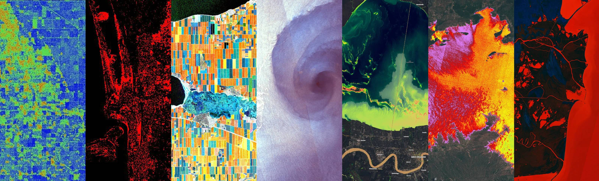

# Collection of custom scripts

---

This repository contains a collection of custom scripts for [Sentinel Hub](https://www.sentinel-hub.com/), which can be fed to the services via the URL.

Custom scripts are a piece of Javascript code, used to visualize satellite imagery and to control what values the Sentinel Hub services will return. Any visualization of any constellation (e.g. Sentinel-2 satellite), even a simple true color composite, is dictated by a custom script.

## Contribute

You are invited to publish your own scripts. For this see the section [Contribute](). See also the [documentation page](https://documentation.dataspace.copernicus.eu/APIs/SentinelHub/Evalscript.html) for custom scripts.

## Navigation

Navigate the webpage with the sidebar on the left. The sidebar provides custom scripts split up by satellite sensors.

Alternatively you can also use the search bar at the top to look for custom scripts that might be of interest to you (try typing in `fire` or `NDVI` for example).

## Relevant reading

