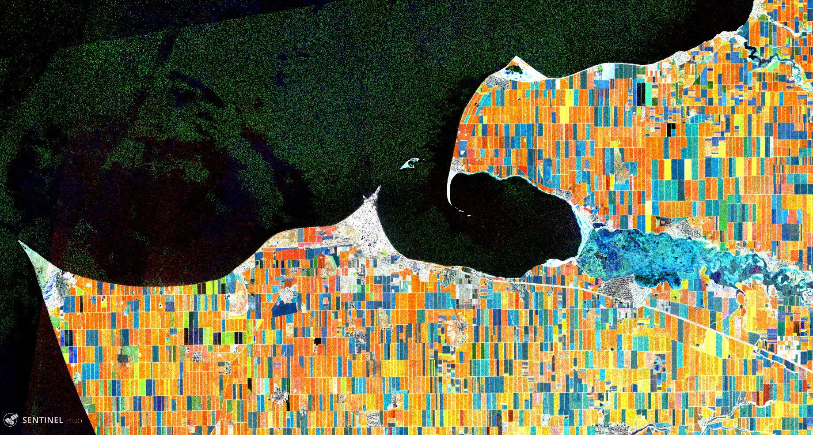

## General description of the script

The script analyses and compares the RVI values using all available radar images. The script calculates the average RVI for the current and previous 2 months and takes the current image as the reference.

## Details of the script

The script works best in lowland areas during active vegetation periods. In addition to terrain mismatches in highlands, other image distortions are possible, that are probably related to satellite orbit and image acquisition mode changes (also regarding Linear to Db problems?).

Images can be over-saturated during prolonged periods of drought/floods and no vegetation change (mostly winter). Usually best idea is to select the reference date in the end of the month and sometimes the date should be changed to better fit the available images (due to change of orbits and acquisition schemes).

Crop properties and VV/VH radar signal limitations have impact on RVI sensitivity (author's understanding is that soybeans are best targets).

It is definitely beneficial to tinker with the pixel evaluation, and value stretch settings, as well as the time-frame of analysis. 

[Some output images.](https://twitter.com/Valtzen/status/1221548334520905729){:target="_blank"}

## Author of the script

Valters Zeizis

## Description of representative images

In the image you can see agriculture fields around Yeya river, Krasnodar region, Russia.

Under the current settings the images would be colored based on the Change of RV (increase, stable, decrease), so:

* black/dark and white/grey areas are where the index is stable, like water (low RVI) or forests (high RVI)
* blue/light blue areas indicate increasing crop growth
* green/yellow areas indicate ripening or ripe crops
* orange/red areas indicate areas of harvested areas

## Credits and references

[1] The script is made using [Sentinel-2 Agricultural growth stage script](https://github.com/hareldunn){:target="_blank"} by Harel Dan and posted on [Twitter](https://twitter.com/sentinel_hub/status/922813457145221121){:target="_blank"}.

[2] Some ideas were also gathered in [SNAP/STEP forums](https://forum.step.esa.int/t/creating-radar-vegetation-index/12444/2){:target="_blank"}.

[3] ResearchGate, [Radar Vegetation Index as an Alternative to NDVI for Monitoring of Soyabean and Cotton](https://www.researchgate.net/publication/267020154_Radar_Vegetation_Index_as_an_Alternative_to_NDVI_for_Monitoring_of_Soyabean_and_Cotton){:target="_blank"}.

[4] MDPI, [Sensitivity of Sentinel-1 Backscatter to Vegetation Dynamics: An Austrian Case Study](https://www.mdpi.com/2072-4292/10/9/1396){:target="_blank"}.
