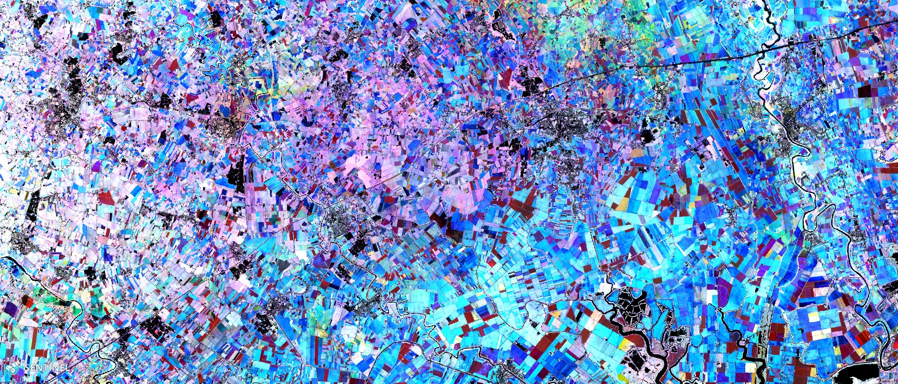

# Agriculture Growth Stage

[Copernicus Browser link]()

## Author of the script

[@HarelDan](https://github.com/hareldunn/GIS_Repo/blob/master/Multi-Temporal%20NDVI%20for%20Sentinel%20Hub%20Custom%20Scripts)

Adapted to [Sentinel-2 Quarterly Cloudless Mosaics](https://documentation.dataspace.copernicus.eu/Data/SentinelMissions/Sentinel2.html#sentinel-2-level-3-quarterly-mosaics) by András Zlinszky (using Github Copilot).

## General description of the script

Agricultural growth stage is a script visualizing the multi-temporal NDVI trends in Sentinel-2 imagery. It takes the current image as baseline and calculates the average NDVI for the previous 2 months.
The script requires multi-temporal processing, so the parameter TEMPORAL=true should be added to the request.
A simple stretching is applied to NDVI between 0.1 and 0.7 by default, then the mean NDVI from the first, second and third month is assigned to the Red, Green and Blue channels of the image respectively, creating a composite image. What you see on the composite is

- how dense and/or vigorous the vegetation is, represented by the brightness of the color from black (no vegetation at all) to white (dense green vegetation all year), with various shades of color in between
- when the vegetation peak happens and how distinct it is. Vegetation with a single very distict peak will be one of the primary colors (Red, Green, Blue) while vegetation with a longer, more even growth season will be yellow (between Red and Green) or cyan (between Green and Blue). Purple color may indicate two vegetation peaks, one in the first month and another in the last, with a dry period or grassland mowing in between.

The adaptation for Sentinel-2 Quarterly Cloudless mosaics also visualizes multi-temporal NDVI trends in Sentinel-2 imagery, but over an even longer timeframe as each mosaic dataset covers 3 months. It uses the NDVI values from three mosaics: the latest mosaic in the provided time interval, the mosaic from the previous quarter and the mosaic two quarters before the last. This means that the script will integrate information over a period of 9 months, typically a full growing season The NDVI values are similarly stretched between 0.1 and 0.7.
Again, the color shades represent

- how dense or vigorous the vegetation is, represented by the intensity of the color (bright colors or white for dense, healthy vegetation)
- when the vegetation peak happens and how distinct it is, on a timescale of several months.

## How to use

- In Copernicus Browser, open the calendar panel dropdown (with the dropdown button on the right)
- Select the time interval view (the calendar icon with arrows on the top right). You will now see two dates, labeled "from" and "until".
- Select these dates to cover an interval of three months for the regular script, or 7 months for the quarterly mosaics. This is because each mosaic represents the three months _after_ its start date. Selecting eg. June 1 to August 31 for regular Sentinel-2 images will cover most of the agriculture growth season, and selecting April 01 to October 01 for the Quarterly Sentinel-2 Mosaics will cover the nine months from April 1 to December 31, including the full vegetation season in the temperate northern hemisphere.
- Select your evalscript of choice from this script website and copy it from the code window above
- In Copernicus Browser, click the `</>` icon beside the name of the active layer to open the evalscript code window
- Select the full text inside the window (eg. with the Ctrl+A hotkey) and paste the evalscript code from the clipboard
- Wait until the data loads - this may take some time for large areas.

## Description of representative images

The Agricultural growth stage script applied to the agricultural fields of Italy (Veneto).

## References

Based on:
[Twitter post (source 1)](https://twitter.com/sentinel_hub/status/922813457145221121),
[Twitter post (source 2)](https://twitter.com/sentinel_hub/status/1020755996359225344)
