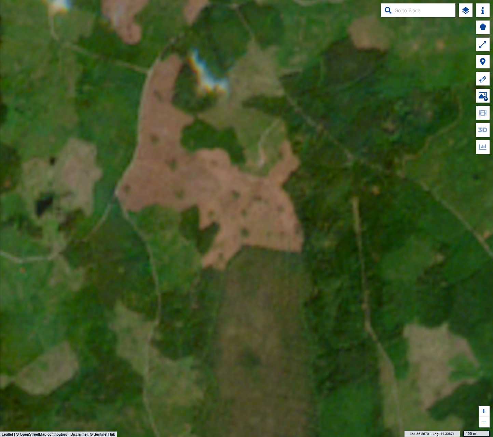
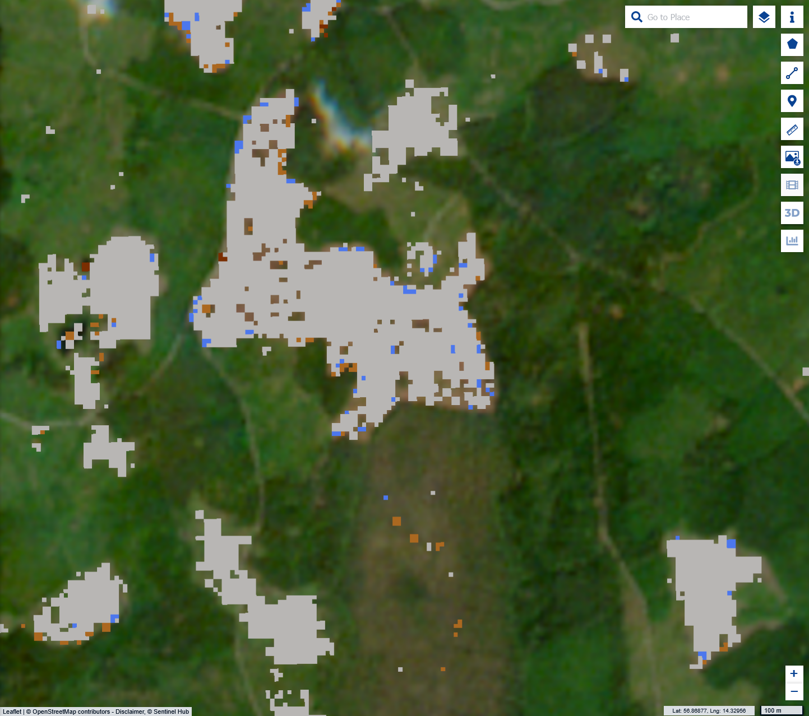
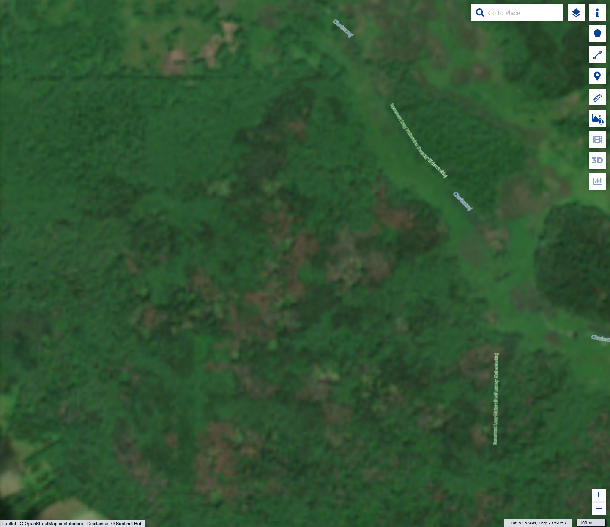
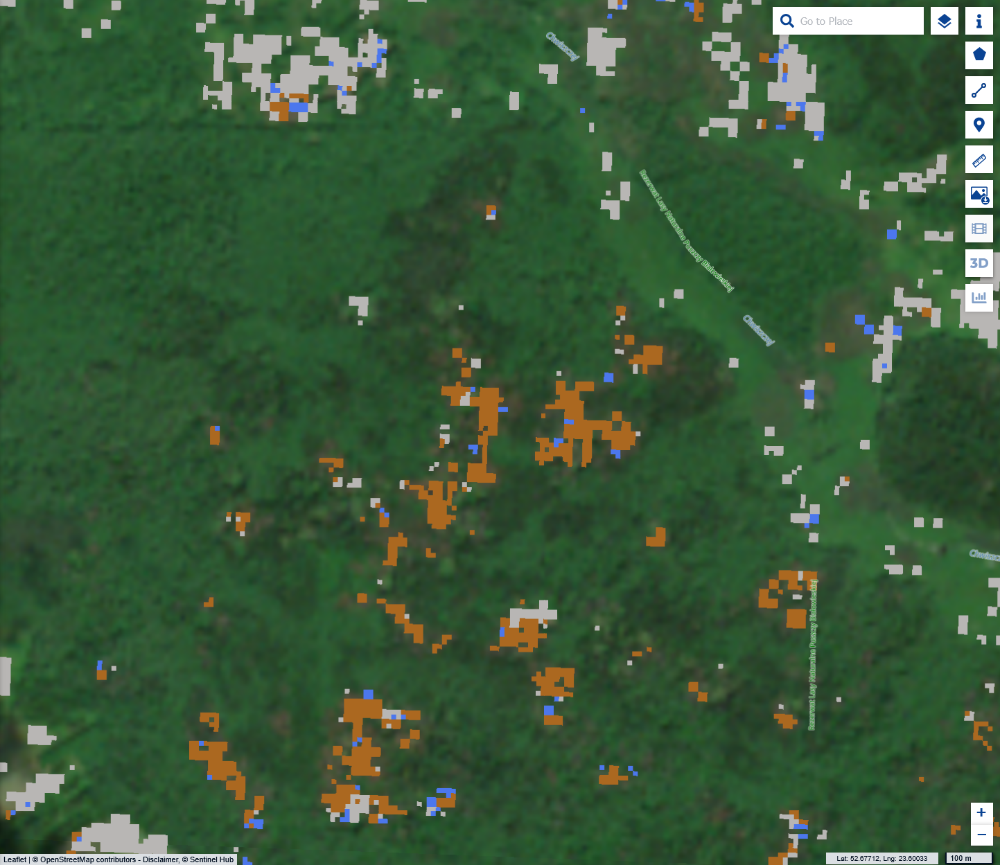
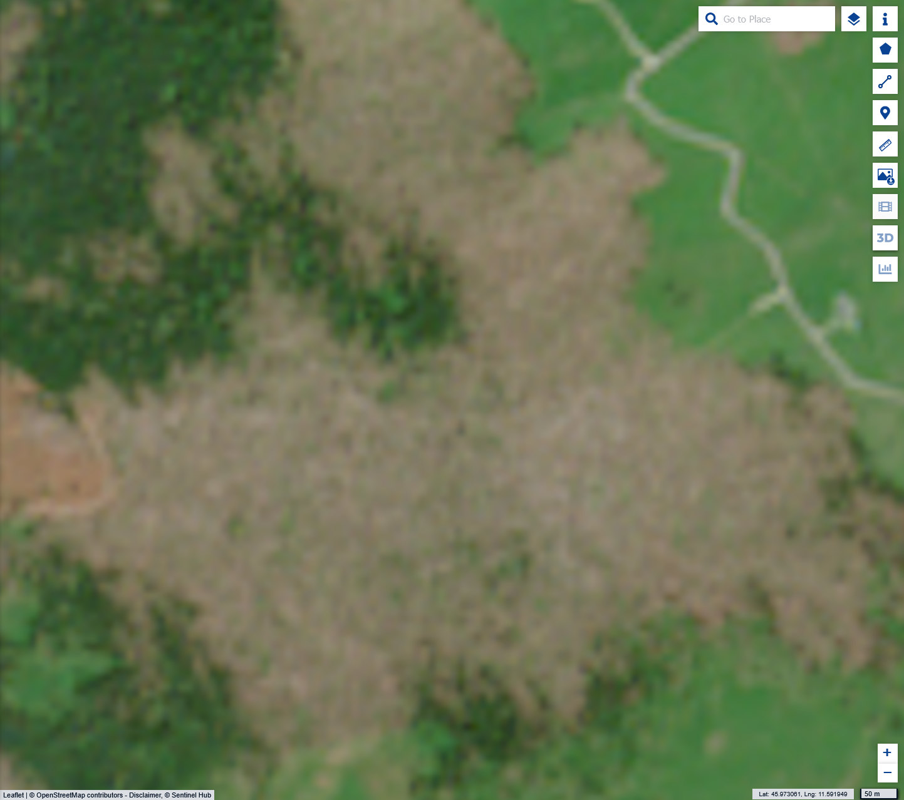
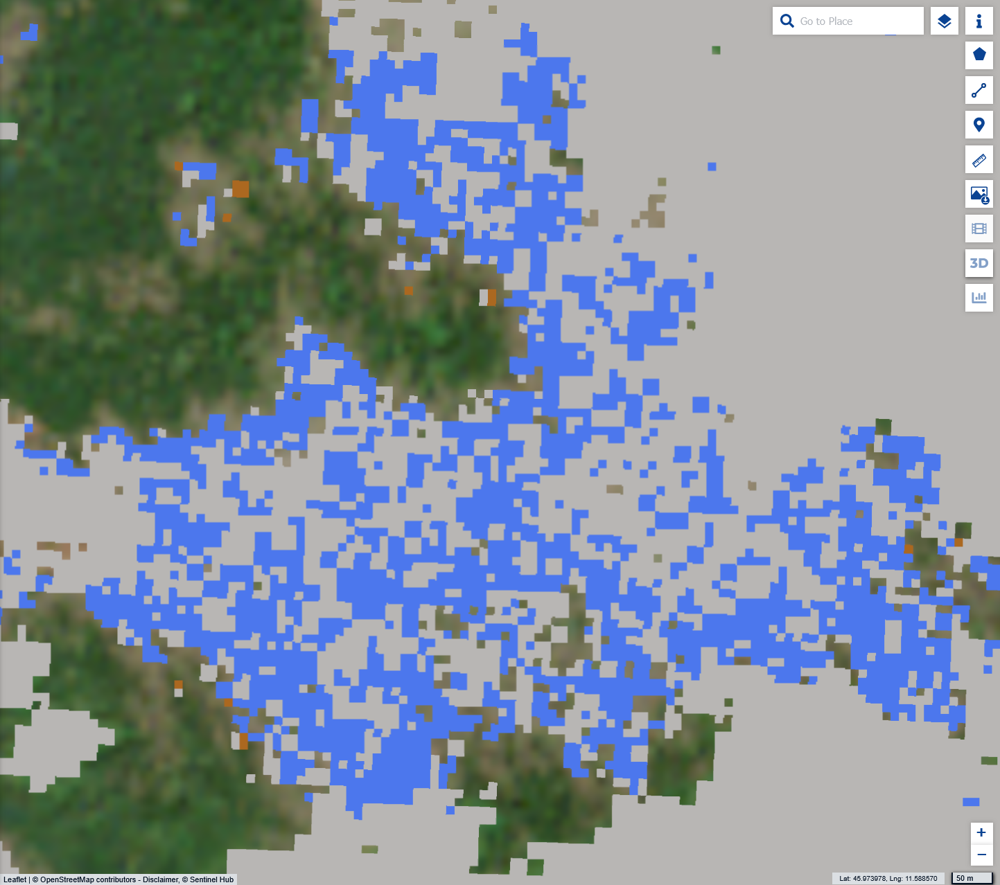
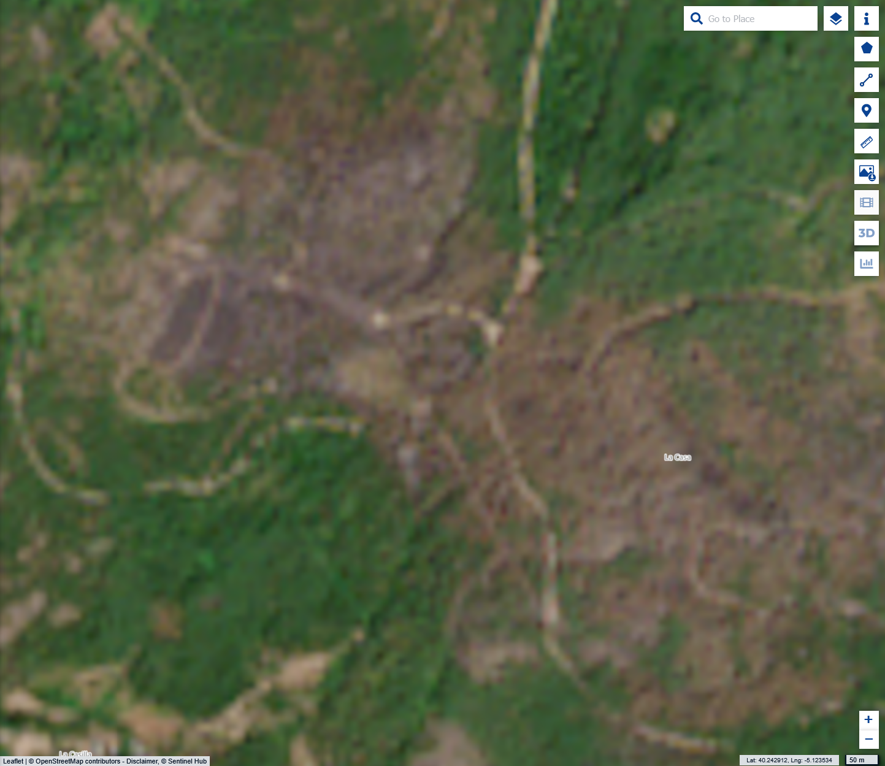
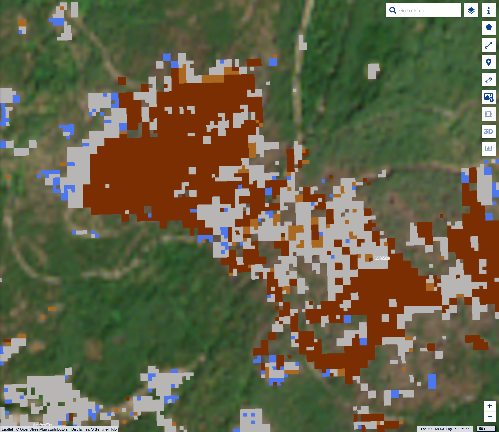

# Forest Disturbance Classification

[Copernicus Browser link]()

## General description of the script

This script provides a LightGBM classification which classifies pixels into different forest disturbance classes.

The following classes can be discerned:

<table>
  <thead>
    <tr>
      <th>Value</th>
      <th>Color</th>
      <th>Label</th>
    </tr>
  </thead>
  <tbody>
    <tr>
      <td>0</td>
      <td style="background-color: #ab6820;"></td>
      <td>0 - Bark Beetle</td>
    </tr>
    <tr>
      <td>1</td>
      <td style="background-color: #b8b6b4;"></td>
      <td>1 - Clear Cut</td>
    </tr>
    <tr>
      <td>2</td>
      <td style="background-color: #215728;"></td>
      <td>2 - Healthy</td>
    </tr>
    <tr>
      <td>3</td>
      <td style="background-color: #b8b6b4;"></td>
      <td>3 - Salvage logged (low confidence)</td>
    </tr>
    <tr>
      <td>4</td>
      <td style="background-color: #7a2e01;"></td>
      <td>4 - Wildfire</td>
    </tr>
    <tr>
      <td>5</td>
      <td style="background-color: #4c77ed;"></td>
      <td>5 - Windthrow</td>
    </tr>
  </tbody>
</table>

The classification was trained on ground truth samples in Europe. Namely Germany, Sweden and Spain. For only taking in spectral features as input and not taking disturbance objects into account during the classification, the classification works reasonably well in European areas. One class separation which does not work well is between salvage logged areas and clear cut areas. Because of this in the visualization we have used the same color for both classes.

In general the classification works best in recently disturbed areas.

Also keep in mind that this script is run on all pixels, irrespective of if the pixel was at one point forest or not. The classification however was only trained and is only valid on forest pixels. So if the classification results are used, please make sure to apply a baseline forest mask.

The classification works best on large scale disturbances.

Although the full model did perform reasonably well in accuracy testing (Macro F1 Score of 0.83), it has to be expected that there are major classification errors. This is especially true in areas outside Europe. Use at own caution and always validate results.

### Types of scripts

There are three scripts available. [One for visualization](./scripts/script.js), this can be used when streaming the data in application using a WMS or similar.
The visualization script has some optimizations for quicker visualization (e.g. early stopping once the majority class is detected). By default the visualization script also only shows disturbed areas and returns transparent pixels for everything it classifies as healthy forest.

For analytic use there are two other scripts available ([Raw](./scripts/raw.js) and [Raw Probabilities](./scripts/raw_prob.js)). One just returns the classified majority class, the other returns the probabilities of each class from 0-100.

## Description of representative images

|  |  |
| :-------------------------------: | :------------------------------------------: |
|     Clear cut area in Sweden      |             [Explore in CDSE]()              |

|  |  |
| :-------------------------------------: | :------------------------------------------------: |
|       Bark Beetle area in Poland        |                [Explore in CDSE]()                 |

|        |  |
| :----------------------------------: | :---------------------------------------: |
| Windthrow area in Italy (Storm Vaia) |            [Explore in CDSE]()            |

|  |  |
| :-------------------------------: | :------------------------------------------: |
|      Wildfire area in Spain       |             [Explore in CDSE]()              |

## Author of the script

Jonas Viehweger and Martin Puhm at [Joanneum Research](https://www.joanneum.at/digital/en/research-groups/fernerkundung-und-geoinformation/)

## Credits

Classification developed as part of the [EvoLand](https://www.evo-land.eu/) research project.
