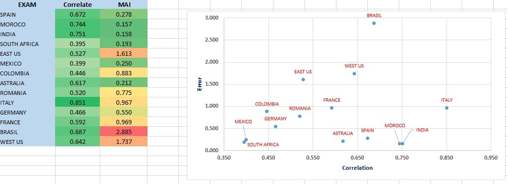
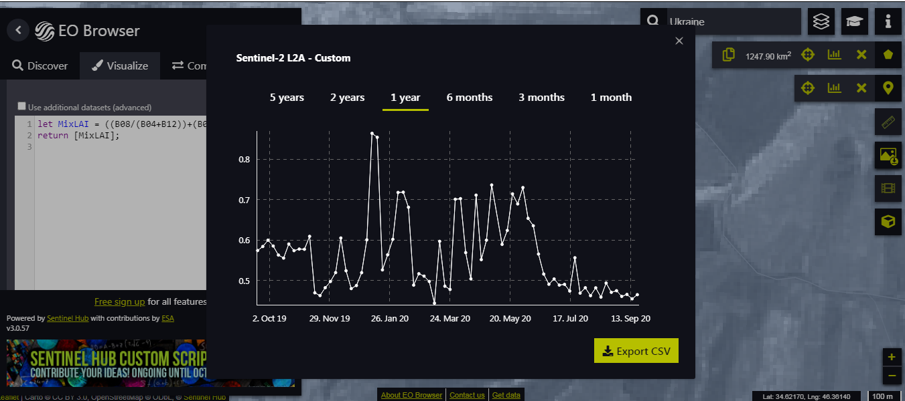
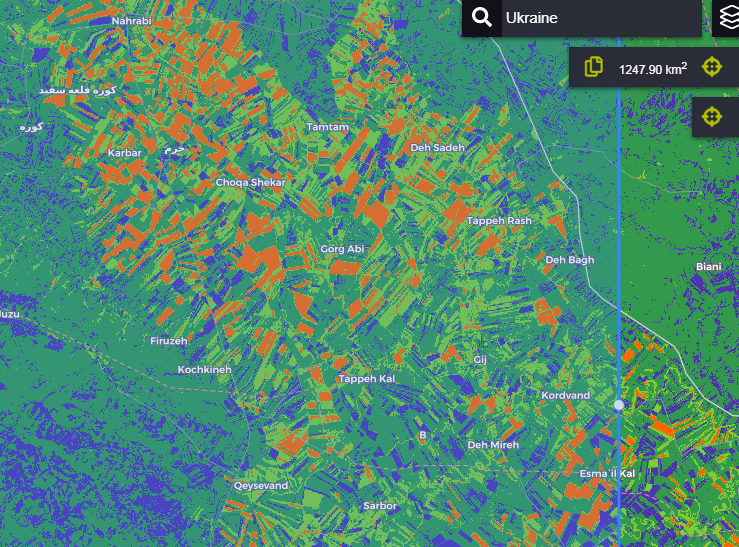

## General description of the script

Globally, improving remotely sensed characterization of biophysical properties of vegetation is of paramount importance for a variety of applications. Changes of Plant Leaf Area and Its Relationships with Soil Factors in the Process of Grassland Desertification. In particular, the non-destructive estimation of the Leaf Area Index (LAI) from earth observation data has been topical for decades. LAI is defined as the one-sided green leaf area per unit ground area. This script represents the leaf area index using the Sentinel 2 satellite. There are examples of this equation, but this equation uses the value of several different bands to calculate the leaf index value in a simple way.

To determine the validity of the index, 14 Exam (point) MCD15A3H product LAI data from around the world were used. The average correlation obtained is 0.594 which is a satisfactory and reassuring result. This data has been used in Iran and using another experimental equation that is the result of a research project under my management, the yields of crops such as dry and irrigated wheat, dry and irrigated barley, and rice have been well predicted.

## Details of the script

Leaf area index is one of the most important parameters in determining plant yields. On the other hand, agricultural scientists calculate this index using special hardware. But because of the global reach of the index in this method, the basis of validation is the data of MODIS product: MCD15A3H (500 M, 4 DAY).

Random data analysis has been selected from all over the world. Product data is obtained from the following address: https://lpdaacsvc.cr.usgs.gov/appeears/explore.

Pearson correlation and mean error methods were used to check the validity of the data. The average error is obtained with this method:

MAE = (ABS(MODIS - S2)/C); MAE: mean absolute error; C: count image (Picture of the same day) in the year: Sep 2019-Sep2020.

exam point of world:

long lat

-3.787585 40.089773

-4.991665 33.647475

75.28038 24.862526

24.106951 -31.276369

-82.253509 34.582171

-101.92016 22.943836

-73.503856 3.385921

149.130662 -30.375819

22.50151 45.943571

11.464104 43.512098

11.664784 51.26062

1.229418 44.669143

-122.048149 44.590588

-67.949633 -5.25761

## Author of the script

Hamid Rahimi

## Description of representative images

Exam Result

Export Chart

Export Image

## References

[1] Gitelson, Anatoly A., ViÒa, AndrÈs, Arkebauer, Timothy J., Rundquist, Donald C., Keydan, Galina, Leavitt, Bryan, 2003. Remote Estimation of Leaf Area Index and Green Leaf Biomass in Maize Canopies.

[2] Lymburner, L., Beggs, P.J., Jacobson, C.R., 2000. Estimation of canopy-average surface-specific leaf area using Landsat TM data. Photogramm. Eng. Remote Sens. 66, 183ñ191.

[3] Mikeladze G, Gavashelishvili A, Akobia I, Metreveli V (2020). Estimation of forest cover change using Sentinel-2 multi-spectral imagery in Georgia (the Caucasus). iForest 13: 329-335. - DOI: 10.3832/ifor3386-013.

[4] Roya Mourad, Hadi Jaafar, Martha Anderson, Feng Gao. (2020) Assessment of Leaf Area Index Models Using Harmonized Landsat and Sentinel-2 Surface Reflectance Data over a Semi-Arid Irrigated Landscape. Remote Sensing 12:19 pages 3121.

## Credits

The present script is the result of combining and simplifying the previous methods. But the initial idea of the script was based on the following basic method:
Lymburner, L., Beggs, P.J., Jacobson, C.R., 2000. Estimation of canopy-average surface-specific leaf area using Landsat TM data. Photogramm. Eng. Remote Sens. 66, 183ñ191.