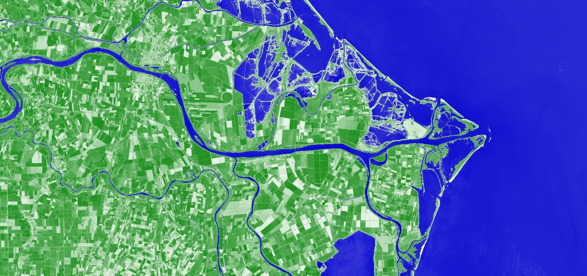
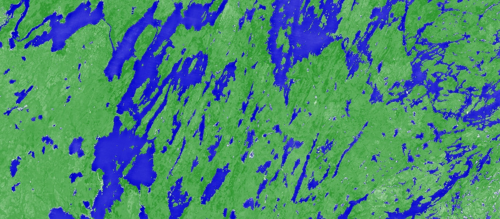

## General description of the script

The NDWI is used to monitor changes related to water content in water bodies. As water bodies strongly absorb light in visible to infrared electromagnetic spectrum,  NDWI uses green and near infrared bands to highlight water bodies. It is sensitive to built-up land and can result in over-estimation of water bodies. The index was proposed by McFeeters, 1996.

- Sentinel-2 NDWI = **(B03 - B08) / (B03 + B08)**
- [Landsat 1-5 MSS NDWI](https://custom-scripts.sentinel-hub.com/landsat-1-5-mss/ndwi/) = **(B01 - B04) / (B01 + B04)**
- [Landsat 4-5 TM NDWI](https://custom-scripts.sentinel-hub.com/landsat-4-5-tm/ndwi/) = **(B03 - B05) / (B03 + B05)**
- [Landsat 7 ETM+ NDWI](https://custom-scripts.sentinel-hub.com/landsat-7-etm/ndwi/) = **(B02 - B04) / (B02 + B04)**
- [Landsat 8 NDWI](https://custom-scripts.sentinel-hub.com/landsat-8/ndwi/) = **(B03 - B05) / (B03 + B05)**
- [MODIS NDWI](https://custom-scripts.sentinel-hub.com/modis/ndwi/) = **(B04 - B02) / (B04 + B02)**

Values description: Index values greater than 0.5 usually correspond to water bodies. Vegetation usually corresponds to much smaller values and built-up areas to values between zero and 0.2.

_Note: NDWI index is often used synonymously with the NDMI index, often using NIR-SWIR combination as one of the two options. NDMI seems to be consistently described using NIR-SWIR combination. As the indices with these two combinations work very differently, with NIR-SWIR highlighting differences in water content of leaves, and GREEN-NIR highlighting differences in water content of water bodies, we have decided to separate the indices on our repository as NDMI using NIR-SWIR, and NDWI using GREEN-NIR._

## Description of representative images

NDWI of Italy. Acquired on 2020-08-01.

NDWI of Canadian lakes. Acquired on 2020-08-05.

## References
Source: https://en.wikipedia.org/wiki/Normalized_difference_water_index
