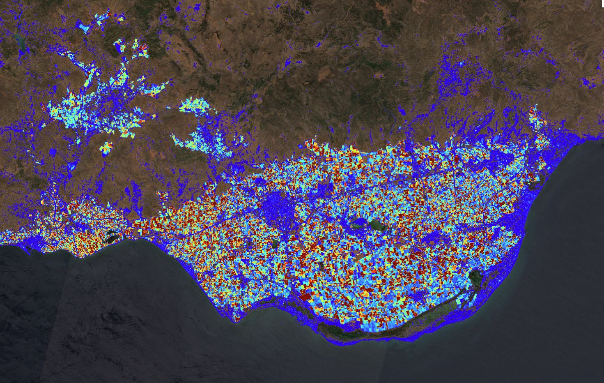

## General description of the script

A simple spectral index for the detection of plastic greenhouses and agricultural foil, based on the Retrogressive Plastic Greenhouse Index developed by Ibrahim et al (2021). Plastic foil reflects strongly in Band 2 (Blue) of Sentinel-2, which is compared against the mean of bands 3 (green), 4 (red) and 8 (near infrared). Detection is not perfect - bare soil areas are sometimes mistaken.

The script assigns a blue to red palette to values of the retrogressive plastic greenhouse index that exceed a certain threshold, and true color to the rest of the pixels.

## Description of representative images

Plastic Greenhouse Index map of the "Sea of Plastic", an area dominated by plastic greenhouses in the Almería region of Spain. As you can see, the index is not selective to land cover (bare soil and coastal areas are labelled), but can be used to separate open and greenhouse horticulture and can contribute to agricultural mapping. [link](https://link.dataspace.copernicus.eu/r5jg)

## References

- Ibrahim, Elsy, and Anne Gobin. "Sentinel-2 recognition of uncovered and plastic covered agricultural soil." Remote Sensing 13, no. 21 (2021): 4195. [Link](https://www.mdpi.com/2072-4292/13/21/4195)
